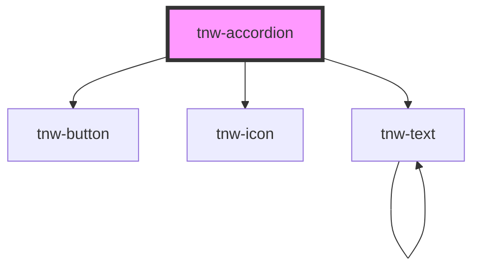

# tnw-accordion-item

<!-- Auto Generated Below -->

## Overview

The `tnw-accordion` component provides a collapsible/expandable section
with a header and body content. It is ideal for use in creating FAQ sections, collapsible panels,
or other UI components requiring content toggling.

## Usage

### Tnw-accordion-usage

### When to use:

- **Collapsible Sections**: Ideal for areas like FAQs, product details, or interactive guides where content needs to be collapsed and expanded to enhance readability and avoid clutter.
- **Grouped Content**: Perfect for organizing related sections under expandable headers, such as multi-step instructions or grouped categories, allowing users to reveal details as needed.

### Use Cases:

1. **Single Item Expanded by Default**:
   Use this when you want to emphasize a specific section by having it open by default, ensuring key content is immediately visible.
   
   @useStory ExpandedByDefault

2. **Accordion with Custom Expand Icon**:
   Customize the expand/collapse icon to fit your design language or to indicate more specific states (e.g., using plus/minus icons for expand/collapse).
   
   @useStory WithCustomIcon

4. **Simple Accordion Appearance**:
   Opt for this style when you prefer a clean, unstyled look for the accordion, allowing it to integrate subtly within various layouts or content sections without drawing extra attention. Ideal for filter panels or settings menus, where functionality is prioritized over visual style.
   
   @useStory NoneAppearance

5. **Multiple Accordions in a Group**:
   For scenarios where users need to explore multiple sections of content without scrolling through everything at once. Common for documentation, settings pages, or any multi-sectioned content display.
   
   See the documentation for `tnw-accordion-group`.

### Additional Considerations:

- **Keyboard Accessibility**: The `tnw-accordion` supports keyboard interaction with the Enter and Space keys for toggling. This ensures that users navigating via keyboard or assistive technologies can interact with the component seamlessly.
- **Customizing Appearance**: The component allows for appearance customizations like `outlined`, `solid`, and `underlined`. Use these appearance options to match your application's visual style or highlight specific accordion content.
- **Icon Rotation Control**: If visual clarity is essential, you can disable the icon rotation on expansion by setting `disableExpandIconRotate` to `true`, providing a consistent icon state if needed.
- **Unique ID Generation**: When no `accordionId` is provided, the component automatically generates a unique ID for accessibility, ensuring each accordion is uniquely identifiable in the DOM without additional setup.

## Properties

| Property                  | Attribute                    | Description                                                                                             | Type                                                                                                                                                                                                                     | Default      |
| ------------------------- | ---------------------------- | ------------------------------------------------------------------------------------------------------- | ------------------------------------------------------------------------------------------------------------------------------------------------------------------------------------------------------------------------ | ------------ |
| `accordionId`             | `accordion-id`               | Unique ID of the accordion item. Used for accessibility.                                                | `string`                                                                                                                                                                                                                 | `undefined`  |
| `appearance`              | `appearance`                 | The appearance color of the accordion.                                                                  | `"none" \| "outlined" \| "solid" \| "transparent" \| "underlined"`                                                                                                                                                       | `'outlined'` |
| `appearanceColor`         | `appearance-color`           | The appearance color of the accordion, determining the overall color scheme.                            | `"auto" \| "black" \| "inverse" \| "light" \| "primary" \| "secondary" \| "white"`                                                                                                                                       | `'auto'`     |
| `borderRadius`            | `border-radius`              | The border radius of the accordion.                                                                     | `"2xl" \| "3xl" \| "circle" \| "default" \| "full" \| "lg" \| "md" \| "none" \| "sm" \| "xl" \| "xs"`                                                                                                                    | `"default"`  |
| `color`                   | `color`                      | The text color of the accordion text.                                                                   | `"auto" \| "black" \| "gray100" \| "gray200" \| "gray300" \| "gray400" \| "gray500" \| "gray600" \| "gray700" \| "gray800" \| "gray900" \| "inverse" \| "light" \| "placeholder" \| "primary" \| "secondary" \| "white"` | `undefined`  |
| `content`                 | `content`                    | The content for the accordion body.                                                                     | `string`                                                                                                                                                                                                                 | `undefined`  |
| `disableExpandIconRotate` | `disable-expand-icon-rotate` | If `true`, the arrow icon rotates when the accordion is expanded to visually indicate the state change. | `boolean`                                                                                                                                                                                                                | `false`      |
| `enableCustomExpandIcon`  | `enable-custom-expand-icon`  | If `true`, a custom icon can be provided via the `icon` slot instead of the default icon.               | `boolean`                                                                                                                                                                                                                | `false`      |
| `expand`                  | `expand`                     | If `true`, the accordion item will be expanded by default.                                              | `boolean`                                                                                                                                                                                                                | `false`      |
| `heading`                 | `heading`                    | The heading of the accordion item, displayed in the header.                                             | `string`                                                                                                                                                                                                                 | `undefined`  |

## Events

| Event              | Description                                                                                                             | Type                                              |
| ------------------ | ----------------------------------------------------------------------------------------------------------------------- | ------------------------------------------------- |
| `accordionToggled` | Emit an event when the accordion item is expanded or collapsed. type: {EventEmitter<{ id: string, expanded: boolean }>} | `CustomEvent<{ id: string; expanded: boolean; }>` |

## Slots

| Slot            | Description                                                                                                                                        |
| --------------- | -------------------------------------------------------------------------------------------------------------------------------------------------- |
| `"body"`        | Slot for custom body content. This slot can only be used if the `content` prop is not set.                                                         |
| `"expand-icon"` | Slot for a custom expand/collapse icon. To use this slot, set the `enableCustomExpandIcon` prop to `true`. If used, it overrides the default icon. |
| `"heading"`     | Slot for custom content to replace the header text. This slot can only be used if the `heading` prop is not set.                                   |

## Shadow Parts

| Part              | Description                                                                                                                               |
| ----------------- | ----------------------------------------------------------------------------------------------------------------------------------------- |
| `"body"`          | The root part of the accordion's body content. It contains the collapsible content of the accordion.                                      |
| `"header"`        | The root `h3` element of the accordion header.                                                                                            |
| `"header-button"` | The clickable `div` inside the `tnw-button` that toggles the accordion. This element wraps both the header text and expand/collapse icon. |
| `"header-icon"`   | The default icon `tnw-icon` that shows the expanded/collapsed state. When the `expand-icon` slot is used, this icon is replaced.          |
| `"header-text"`   | The `tnw-text` component displaying the accordion's heading.                                                                              |

## Dependencies

### Depends on

- [tnw-button](../tnw-button)
- [tnw-icon](../tnw-icon)
- [tnw-text](../tnw-text)

### Graph

----------------------------------------------

*Built with [StencilJS](https://stenciljs.com/)*
