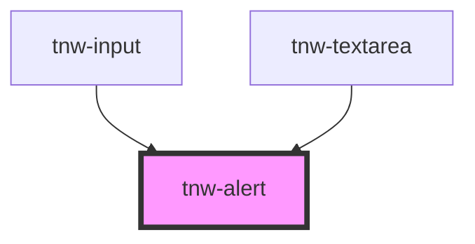

# tnw-alert

<!-- Auto Generated Below -->

## Overview

The `tnw-alert` component is used to display a prominent message to the user, such as
important notifications, success messages, warnings, or errors.

## Usage

### Tnw-alert-usage

### When to use:

- **Displaying Important Messages**: Use `tnw-alert` when you need to show prominent messages to users, such as notifications, success messages, warnings, or errors. It's ideal for guiding users with critical information that requires immediate attention.
- **Feedback for User Actions**: Alerts are great for providing feedback to users after they perform actions, such as submitting a form, encountering an error, or completing a task successfully.

### Use Cases:

1. **Standard Alert for General Information**:
   Use this when you need to display a regular message, such as notifying users of basic information or guidance.

   @useStory Standard

2. **Success, Warning, Info, and Danger Alerts**:
   Use different variants based on the message type—success for positive feedback, warning for potential issues, info for guidance, and danger for errors or critical problems.

   @useStory SuccessAlert
   @useStory WarningAlert
   @useStory InfoAlert
   @useStory DangerAlert

3. **Alert with Custom Appearance**:
   If you need a more distinct look for your alerts, such as outlined or solid backgrounds, you can customize the appearance of the alert based on your design requirements.

   @useStory InfoOutlinedAppearance
   @useStory SuccessSolidAppearance
   @useStory DangerMixedAppearance

4. **Large Alerts for Emphasis**:
   When you need to emphasize a message even more, use a larger size for the alert, especially for warnings or errors where visibility is crucial.

   @useStory LargeDanger

### Additional Considerations:

- **Accessibility**: The `tnw-alert` component is fully accessible with proper ARIA attributes like `aria-live="assertive"`, ensuring that screen readers announce the alert content immediately when it appears.
- **Persistent vs Temporary Alerts**: Depending on your design and use case, you can control whether the alert should be visible at all times or hidden after some action using the `isHidden` prop.
- **Styling Variants**: Different appearances such as `solid`, `outlined`, or `mixed` provide flexibility to match your application's visual needs, allowing alerts to either stand out or blend in depending on the context.
- **Custom Border Radius**: You can adjust the border radius to ensure the alert fits well with other components in your layout or to give it a distinct, modern look.

## Properties

| Property               | Attribute          | Description                                                                                                                                                                 | Type                                                                                                  | Default         |
| ---------------------- | ------------------ | --------------------------------------------------------------------------------------------------------------------------------------------------------------------------- | ----------------------------------------------------------------------------------------------------- | --------------- |
| `alertId` _(required)_ | `alert-id`         | The unique ID for the alert message. This ID is important for accessibility purposes, helping to associate the alert with form elements or any other triggering components. | `string`                                                                                              | `undefined`     |
| `appearance`           | `appearance`       | The appearance of the alert, defining how the alert will be styled.                                                                                                         | `"mixed" \| "none" \| "outlined" \| "solid" \| "transparent"`                                         | `'transparent'` |
| `appearanceColor`      | `appearance-color` | The appearance color of the alert, defining the type of message being displayed.                                                                                            | `"danger" \| "info" \| "success" \| "warning"`                                                        | `undefined`     |
| `borderRadius`         | `border-radius`    | The border radius of the alert.                                                                                                                                             | `"2xl" \| "3xl" \| "circle" \| "default" \| "full" \| "lg" \| "md" \| "none" \| "sm" \| "xl" \| "xs"` | `'default'`     |
| `isHidden`             | `is-hidden`        | Controls whether the alert is visible or hidden. When `true`, the component does not render                                                                                 | `boolean`                                                                                             | `false`         |
| `message` _(required)_ | `message`          | The message text to display in the alert. This is the main content of the alert and should be concise but informative.                                                      | `string`                                                                                              | `undefined`     |
| `size`                 | `size`             | Defines the font size of the alert message.                                                                                                                                 | `"lg" \| "md" \| "sm"`                                                                                | `'sm'`          |

## Shadow Parts

| Part     | Description                                        |
| -------- | -------------------------------------------------- |
| `"text"` | The `p` element containing the alert message text. |

## Dependencies

### Used by

 - [tnw-input](../tnw-input)
 - [tnw-textarea](../tnw-textarea)

### Graph

----------------------------------------------

*Built with [StencilJS](https://stenciljs.com/)*
