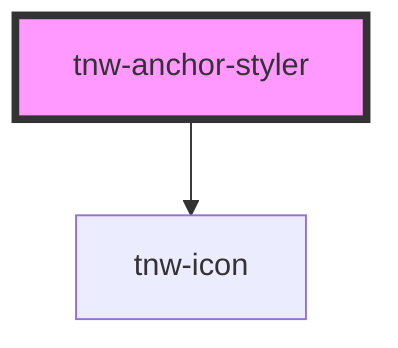

# tnw-anchor-styler

<!-- Auto Generated Below -->

## Overview

The `tnw-anchor-styler` component is a decorative wrapper for custom anchor-like elements.
It focuses purely on styling and requires slotted children for its content.

This component is particularly suitable for use with React Router's `Link` or `NavLink` components 
and Next.js's `Link` components, where navigation functionality is handled externally, 
and styling can be applied through this wrapper.

## Usage

### Tnw-anchor-styler-usage

## Properties

| Property           | Attribute             | Description                                                                                                   | Type                                                                                                                                                                                                                     | Default       |
| ------------------ | --------------------- | ------------------------------------------------------------------------------------------------------------- | ------------------------------------------------------------------------------------------------------------------------------------------------------------------------------------------------------------------------ | ------------- |
| `color`            | `color`               | Sets the color of the text based on the available colors.                                                     | `"auto" \| "black" \| "gray100" \| "gray200" \| "gray300" \| "gray400" \| "gray500" \| "gray600" \| "gray700" \| "gray800" \| "gray900" \| "inverse" \| "light" \| "placeholder" \| "primary" \| "secondary" \| "white"` | `'auto'`      |
| `enableNewTabIcon` | `enable-new-tab-icon` | Enables the new tab icon.                                                                                     | `boolean`                                                                                                                                                                                                                | `false`       |
| `size`             | `size`                | Sets the font size of the anchor text.                                                                        | `"2xl" \| "3xl" \| "4xl" \| "5xl" \| "6xl" \| "7xl" \| "8xl" \| "9xl" \| "heading" \| "lg" \| "md" \| "sm" \| "text" \| "xl" \| "xs"`                                                                                    | `undefined`   |
| `text`             | `text`                | Specifies the text content of the link. If not provided, the content should be provided via the default slot. | `string`                                                                                                                                                                                                                 | `undefined`   |
| `textDecoration`   | `text-decoration`     | Specifies the text decoration line of the anchor text.                                                        | `"line-through" \| "none" \| "overline" \| "underline"`                                                                                                                                                                  | `'underline'` |

## Slots

| Slot | Description                                                                     |
| ---- | ------------------------------------------------------------------------------- |
|      | Default slot for custom content (e.g., an anchor, text, or any HTML structure). |

## Shadow Parts

| Part        | Description                                                    |
| ----------- | -------------------------------------------------------------- |
| `"icon"`    |                                                                |
| `"wrapper"` | The `
` element that wraps and styles the slotted content. |

## Dependencies

### Depends on

- [tnw-icon](../tnw-icon)

### Graph

----------------------------------------------

*Built with [StencilJS](https://stenciljs.com/)*
