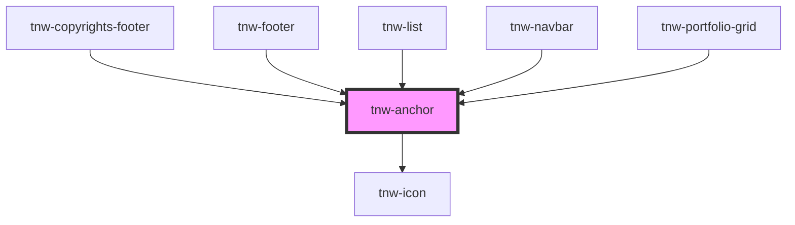

# tnw-anchor

<!-- Auto Generated Below -->

## Overview

The `tnw-anchor` component is a versatile anchor link element that can be used to navigate to other pages or external resources.
This component supports both text content and custom content via a slot, making it flexible for various use cases, such as wrapping other elements like images or icons.

## Usage

### Tnw-anchor-usage

### When to use:

- **Basic Links**: Use `tnw-anchor` when you need a standard text-based hyperlink to navigate users to other pages or external resources.
- **Custom Content Links**: The component is also suitable when you want to wrap custom content like images, icons, or cards in a link, providing flexibility beyond simple text links.
- **New Tab Links**: Use `tnw-anchor` to create links that open in a new tab when navigating to external resources, while optionally hiding or displaying the "new tab" icon.

### Use Cases:

1. **Standard Text Link**:
   Use this for regular text-based navigation, such as linking to other websites or internal pages.

   @useStory Standard

2. **Colored Link**:
   You can modify the text color using predefined color options to ensure the link visually aligns with your design theme.

   @useStory PrimaryColor

3. **Link that Opens in a New Tab**:
   When linking to external sites, use this case to open the link in a new browser tab. You can also choose to show or hide the "new tab" icon based on your preferences.

   @useStory OpenInNewTab

4. **Custom Content Inside Anchor**:
   Wrap custom content like images or icons within the anchor tag to create complex, clickable elements, such as a linked image or card. 
   
   **Important for a11y**: When using non-text content like images or icons, ensure that an appropriate `labelAria` is provided. This is crucial for accessibility, as it helps screen readers and other assistive technologies understand the purpose of the link.

   @useStory CustomContent

### Additional Considerations:

- **Accessibility**: The component supports custom `aria-label` properties. If the anchor content is not text-based (e.g., images, icons), always provide an `aria-label` to describe the link's purpose, ensuring it’s accessible to screen readers. If no `labelAria` is provided, it defaults to the `text` prop or falls back to a generic "Link" label.
- **Customizable Text Decoration**: You can easily control the text decoration (`underline`, `overline`, `none`) to match your application's style and requirements.
- **New Tab Behavior**: For external links, the `newTab` option ensures that the link opens safely in a new tab with proper `noopener noreferrer` attributes for security.
- **Dynamic Slot Usage**: If custom content is placed in the slot (e.g., images or complex HTML), ensure the `text` prop is not used simultaneously, and provide a `labelAria` for accessibility.

## Properties

| Property            | Attribute           | Description                                                                                                                                                                                                   | Type                                                                                                                                                                                                                     | Default       |
| ------------------- | ------------------- | ------------------------------------------------------------------------------------------------------------------------------------------------------------------------------------------------------------- | ------------------------------------------------------------------------------------------------------------------------------------------------------------------------------------------------------------------------ | ------------- |
| `color`             | `color`             | Sets the color of the text based on the available colors.                                                                                                                                                     | `"auto" \| "black" \| "gray100" \| "gray200" \| "gray300" \| "gray400" \| "gray500" \| "gray600" \| "gray700" \| "gray800" \| "gray900" \| "inverse" \| "light" \| "placeholder" \| "primary" \| "secondary" \| "white"` | `'auto'`      |
| `hideNewTabIcon`    | `hide-new-tab-icon` | Hides the new tab icon.                                                                                                                                                                                       | `boolean`                                                                                                                                                                                                                | `false`       |
| `href` _(required)_ | `href`              | Specifies the URL that the link navigates to. This prop is required.                                                                                                                                          | `string`                                                                                                                                                                                                                 | `undefined`   |
| `labelAria`         | `label-aria`        | Specifies the aria-label for the anchor, providing an accessible name for screen readers. If not provided, it defaults to the value of the `text` prop or falls back to a custom value if content is slotted. | `string`                                                                                                                                                                                                                 | `undefined`   |
| `newTab`            | `new-tab`           | Specifies whether the link should open in a new browser tab.                                                                                                                                                  | `boolean`                                                                                                                                                                                                                | `false`       |
| `size`              | `size`              | Sets the font size of the anchor text.                                                                                                                                                                        | `"2xl" \| "3xl" \| "4xl" \| "5xl" \| "6xl" \| "7xl" \| "8xl" \| "9xl" \| "heading" \| "lg" \| "md" \| "sm" \| "text" \| "xl" \| "xs"`                                                                                    | `undefined`   |
| `text`              | `text`              | Specifies the text content of the link. If not provided, the content should be provided via the default slot.                                                                                                 | `string`                                                                                                                                                                                                                 | `undefined`   |
| `textDecoration`    | `text-decoration`   | Specifies the text decoration line of the anchor text.                                                                                                                                                        | `"line-through" \| "none" \| "overline" \| "underline"`                                                                                                                                                                  | `'underline'` |

## Slots

| Slot | Description                                                                        |
| ---- | ---------------------------------------------------------------------------------- |
|      | Default slot for custom content (e.g., an image, icon, or complex HTML structure). |

## Shadow Parts

| Part       | Description                                                                                                                  |
| ---------- | ---------------------------------------------------------------------------------------------------------------------------- |
| `"anchor"` | The `<a>` element that serves as the anchor link. Use this part for styling the anchor element.                              |
| `"icon"`   | The `<tnw-icon>` element that displays the "new tab" icon. Only rendered if the property `hideNewTabIcon` is set to `false`. |

## Dependencies

### Used by

 - [tnw-copyrights-footer](../tnw-copyrights-footer)
 - [tnw-footer](../tnw-footer)
 - [tnw-list](../tnw-list)
 - [tnw-navbar](../tnw-navbar)
 - [tnw-portfolio-grid](../tnw-portfolio-grid)

### Depends on

- [tnw-icon](../tnw-icon)

### Graph

----------------------------------------------

*Built with [StencilJS](https://stenciljs.com/)*
