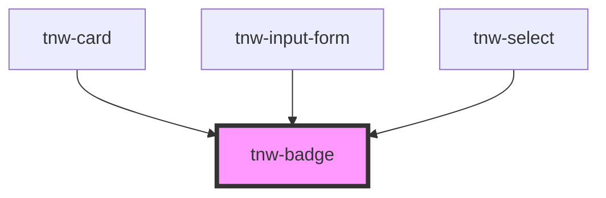

# tnw-badge

<!-- Auto Generated Below -->

## Overview

The `tnw-badge` component is used to display small pieces of information, such as labels, statuses, or counts, in a compact and visually distinct way.
This component supports various customization options including different variants, appearances, and sizes, making it versatile for a wide range of use cases.

## Usage

### Tnw-badge-usage

### When to use:

- **Displaying Status or Counts**: Use `tnw-badge` to highlight small but important information, such as notifications, counts, or status indicators.
- **Labeling and Tagging**: The badge is great for labeling items with brief, distinct tags, such as "New", "Sale", or "Featured".
- **Custom Content Badges**: You can wrap custom content like icons inside the badge, allowing for more flexible designs that go beyond simple text labels.

### Use Cases:

1. **Standard Badge**:
   Use this to display basic text, such as a status label or tag.

   @useStory Standard

2. **Outlined Badge**:
   Use this variant when you want a badge with an outlined appearance, great for visually distinct but lightweight labels.

   @useStory OutlinedPrimary

3. **Badge with Different Sizes**:
   The badge size can be adjusted depending on where it is used. Smaller badges are ideal for inline labels, while larger badges can be used for emphasis.

   @useStory SmallBadge
   @useStory LargeBadge

4. **Badge Displaying Numbers**:
   Badges can also display numbers, often used for notifications or counts.

   @useStory NumericBadge

### Additional Considerations:

- **Accessibility**: Ensure the badge is used with meaningful content. If a badge is used for notifications or important status information, consider adding appropriate ARIA attributes or screen reader labels.
- **Custom Content via Slot**: When using custom content (e.g., an icon or image), ensure the `label` prop is not used. Instead, provide content through the default slot for maximum flexibility.
- **Appearance and Styling**: You can customize the badge appearance with different variants (`outlined`, `solid`, `mixed`), and adjust the size and border radius to match your design needs.
- **Dynamic Content**: The badge is flexible for displaying dynamic information, such as live counts or status changes, and can adapt to various use cases.

## Properties

| Property          | Attribute          | Description                                                                                                                                                                                                                                                                                                                                                                                                | Type                                                                                                                               | Default      |
| ----------------- | ------------------ | ---------------------------------------------------------------------------------------------------------------------------------------------------------------------------------------------------------------------------------------------------------------------------------------------------------------------------------------------------------------------------------------------------------- | ---------------------------------------------------------------------------------------------------------------------------------- | ------------ |
| `appearance`      | `appearance`       | The appearance determines the overall style of the badge, such as whether it is solid or outlined.                                                                                                                                                                                                                                                                                                         | `"mixed" \| "none" \| "outlined" \| "solid" \| "transparent"`                                                                      | `'outlined'` |
| `appearanceColor` | `appearance-color` | The color appearance color of the badge, determining the overall color scheme.                                                                                                                                                                                                                                                                                                                             | `"auto" \| "black" \| "danger" \| "info" \| "inverse" \| "light" \| "primary" \| "secondary" \| "success" \| "warning" \| "white"` | `'auto'`     |
| `borderRadius`    | `border-radius`    | The border radius of the badge. it will be ignored if variant is not textual.                                                                                                                                                                                                                                                                                                                              | `"2xl" \| "3xl" \| "circle" \| "default" \| "full" \| "lg" \| "md" \| "none" \| "sm" \| "xl" \| "xs"`                              | `'lg'`       |
| `imageSrc`        | `image-src`        | The source URL of the image to display inside the badge when the variant is set to 'image'. If not provided, the badge will not display an image.                                                                                                                                                                                                                                                          | `string`                                                                                                                           | `undefined`  |
| `label`           | `label`            | The text or label displayed inside the badge. If not provided, custom content can be inserted via the slot. If the variant is `numeric`, the label will be limited to 99+.                                                                                                                                                                                                                                 | `number \| string`                                                                                                                 | `undefined`  |
| `size`            | `size`             | The size of the badge. controls padding if the variant is textual, else it controls width with height.                                                                                                                                                                                                                                                                                                     | `"lg" \| "md" \| "sm"`                                                                                                             | `'sm'`       |
| `variant`         | `variant`          | Specifies the variant of the badge.  - `image`: The badge will display an image. label will be ignored. - `color`: The badge will display a color. label and slot will be ignored. - `textual`: The badge will display text. label will be displayed. - `numeric`: The badge will display a number. even if the number is larger 99, the number displayed will be 99+.   The label will be limited to 99+. | `"image" \| "numeric" \| "status" \| "textual"`                                                                                    | `'textual'`  |

## Slots

| Slot | Description                                                                                                                             |
| ---- | --------------------------------------------------------------------------------------------------------------------------------------- |
|      | Default slot for custom content inside the badge (e.g., icon or HTML structure). The `label` prop must not be used if the slot is used. |

## Dependencies

### Used by

 - [tnw-card](../tnw-card)
 - [tnw-input-form](../tnw-input-form)
 - [tnw-select](../tnw-select)

### Graph

----------------------------------------------

*Built with [StencilJS](https://stenciljs.com/)*
