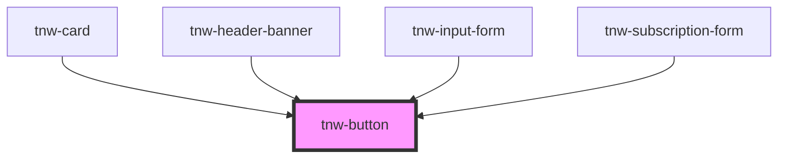

# tnw-button

<!-- Auto Generated Below -->

## Overview

The `tnw-button` component is a customizable button element, which can be used as a standalone button or as a button in a form.
It supports various styles, sizes, and appearances, and allows for custom content to be inserted via a slot.
By default, the component renders a button element, but it can also render an anchor element if the `href` prop is provided.

## Usage

### Tnw-button-usage

### When to use:

- **Action Buttons**: Use `tnw-button` for actions like submitting forms, triggering events, or interacting with the interface.
- **Custom Link Buttons**: When you need a button that functions as a link (e.g., navigating to a new page), use `tnw-button` with the `href` prop.
- **Buttons with Icons**: For buttons that need icons before or after the label (e.g., for visual emphasis or direction), use the available slots.

### Use Cases:

1. **Standard Button**:
   Use this for common actions like clicking or submitting forms.

   @useStory Standard

3. **Button as Link**:
   When a button needs to navigate to an external site or another page, use this case, and configure it to open in a new tab if needed.

   @useStory ButtonAsLink

4. **Button with Start Icon**:
   Add an icon before the button text for added clarity or branding.

   @useStory WithStartIcon

### Additional Considerations:

- **Accessibility**: Ensure proper ARIA attributes are in place, especially for buttons that act as links or are disabled.
- **Button or Link**: The button will render as an anchor (`<a>`) when the `href` prop is provided, enabling navigation while retaining button styling.
- **Custom Styling**: The button supports customization for appearance, size, and hover effects, allowing it to fit various design needs in your application.

## Properties

| Property               | Attribute                | Description                                                                        | Type                                                                                                                               | Default     |
| ---------------------- | ------------------------ | ---------------------------------------------------------------------------------- | ---------------------------------------------------------------------------------------------------------------------------------- | ----------- |
| `appearance`           | `appearance`             | Specifies the appearance color of the button.                                      | `"mixed" \| "none" \| "outlined" \| "solid" \| "transparent"`                                                                      | `'solid'`   |
| `appearanceColor`      | `appearance-color`       | Defines the appearance color of the button.                                        | `"auto" \| "black" \| "danger" \| "info" \| "inverse" \| "light" \| "primary" \| "secondary" \| "success" \| "warning" \| "white"` | `'primary'` |
| `borderRadius`         | `border-radius`          | Specifies the border radius of the button.                                         | `"2xl" \| "3xl" \| "circle" \| "default" \| "full" \| "lg" \| "md" \| "none" \| "sm" \| "xl" \| "xs"`                              | `'default'` |
| `disabled`             | `disabled`               | Specifies whether the button is disabled.                                          | `boolean`                                                                                                                          | `false`     |
| `hoverAppearance`      | `hover-appearance`       | Specifies the hover appearance color for the button.                               | `"none" \| "outlined" \| "solid"`                                                                                                  | `'none'`    |
| `hoverAppearanceColor` | `hover-appearance-color` | Specifies the hover appearance color color for the button color.                   | `"auto" \| "black" \| "inverse" \| "primary" \| "secondary" \| "white"`                                                            | `'primary'` |
| `hoverEffect`          | `hover-effect`           | Specifies the hover effect of the button.                                          | `"contrast" \| "none" \| "opacity" \| "scale-down" \| "scale-up"`                                                                  | `'none'`    |
| `href`                 | `href`                   | If provided, the button will render as a link with this `href`.                    | `string`                                                                                                                           | `undefined` |
| `label`                | `label`                  | Specifies the text label displayed on the button. This prop is required.           | `string`                                                                                                                           | `undefined` |
| `newTab`               | `new-tab`                | If `true`, the link will open in a new tab. Only relevant when `href` is provided. | `boolean`                                                                                                                          | `false`     |
| `size`                 | `size`                   | Determines the size of the button.                                                 | `"lg" \| "md" \| "sm" \| "xl" \| "xs"`                                                                                             | `'md'`      |
| `type`                 | `type`                   | Specifies the button type.                                                         | `"button" \| "submit"`                                                                                                             | `'button'`  |

## Slots

| Slot           | Description                                                           |
| -------------- | --------------------------------------------------------------------- |
| `"icon-end"`   | Slot for adding an icon or custom content at the end of the button.   |
| `"icon-start"` | Slot for adding an icon or custom content at the start of the button. |

## Shadow Parts

| Part       | Description                                      |
| ---------- | ------------------------------------------------ |
| `"button"` | The main clickable `button` or `anchor` element. |

## Dependencies

### Used by

 - [tnw-card](../tnw-card)
 - [tnw-header-banner](../tnw-header-banner)
 - [tnw-input-form](../tnw-input-form)
 - [tnw-subscription-form](../tnw-subscription-form)

### Graph

----------------------------------------------

*Built with [StencilJS](https://stenciljs.com/)*
