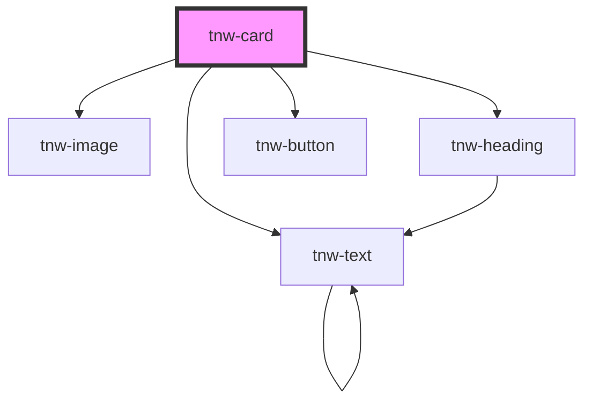

# tnw-card

<!-- Auto Generated Below -->

## Overview

The `tnw-card` component is a flexible container used to display content such as images, text, and buttons in a 
card layout. It supports various customization options for layout orientation, appearance styles, spacing, 
and content alignment. The card can display images, headings, subheadings, descriptions, and buttons, 
with slots for each, allowing full customization.

## Usage

### Tnw-card-usage

### When to use:

- **Content Display**: Use `tnw-card` to structure and display different types of content, such as images, text, and buttons, in a compact and visually appealing layout.
- **Call to Action**: It’s ideal for scenarios where you want to encourage user interaction, such as featuring a product, service, or article with an accompanying button.
- **Flexible Layouts**: Cards can be laid out either vertically or horizontally, making them adaptable to various design needs and responsive contexts.

### Use Cases:

1. **Default Card with Image and Content**:
   Use this case for standard card displays that include an image, heading, subheading, description, and a button for user interaction.

   @useStory Default

2. **Horizontal Layout Card**:
   Use this when you want the card's content to be arranged horizontally, with the image and text side by side.

   @useStory HorizontalLayout

3. **Card with Content Displayed First**:
   This layout is useful when you want the text content to appear before the image, emphasizing the message over the visual element.

   @useStory ContentFirst

4. **Card without an Image**:
   When the card content does not require an image, this variant focuses on textual content and a call to action.

   @useStory WithoutImage

5. **Card with Different Appearances**:
   Customize the card's appearance for different design styles. Use outlined or solid backgrounds based on your branding and visual needs.

   @useStory OutlinedAppearance
   @useStory SolidAppearance

### Additional Considerations:

- **Custom Content Flexibility**: With customizable slots for the image, heading, subheading, description, and button, `tnw-card` allows for maximum flexibility in content arrangement. You can even replace default content with fully custom structures by using the `content` slot.
- **Layouts**: The card can be arranged vertically or horizontally, and content can be ordered before or after the image to suit your design needs.
- **Glassmorphism**: You can apply a glassmorphism effect for a modern, frosted-glass aesthetic on the card's background.
- **Accessibility**: Ensure meaningful content is provided in the card, especially for headings and buttons, to make it accessible and user-friendly.

## Properties

| Property                 | Attribute                  | Description                                                                                                                                 | Type                                                                                                  | Default      |
| ------------------------ | -------------------------- | ------------------------------------------------------------------------------------------------------------------------------------------- | ----------------------------------------------------------------------------------------------------- | ------------ |
| `appearance`             | `appearance`               | The appearance style of the card.                                                                                                           | `"mixed" \| "none" \| "outlined" \| "solid" \| "transparent"`                                         | `'none'`     |
| `borderRadius`           | `border-radius`            | The border radius applied to the card.                                                                                                      | `"2xl" \| "3xl" \| "circle" \| "default" \| "full" \| "lg" \| "md" \| "none" \| "sm" \| "xl" \| "xs"` | `'default'`  |
| `buttonLabel`            | `button-label`             | The label for the card's button.                                                                                                            | `string`                                                                                              | `undefined`  |
| `description`            | `description`              | The card's description text.                                                                                                                | `string`                                                                                              | `undefined`  |
| `enableContentSlot`      | `enable-content-slot`      | If `true`, the heading, subheading, description, and button will not be rendered. Use the `content` slot to provide custom content instead. | `boolean`                                                                                             | `false`      |
| `enableImageSlot`        | `enable-image-slot`        | If `true`, the image slot will be visible.                                                                                                  | `boolean`                                                                                             | `false`      |
| `heading`                | `heading`                  | The card's heading text.                                                                                                                    | `string`                                                                                              | `undefined`  |
| `imageAlt`               | `image-alt`                | Alternate text for the image.                                                                                                               | `string`                                                                                              | `undefined`  |
| `imageSrc`               | `image-src`                | The image source for the card.                                                                                                              | `string`                                                                                              | `undefined`  |
| `itemsAlignment`         | `items-alignment`          | Controls the alignment of items within the card.                                                                                            | `"center" \| "end" \| "start"`                                                                        | `undefined`  |
| `layout`                 | `layout`                   | Specifies the layout orientation of the card, either 'vertical' or 'horizontal'.                                                            | `"horizontal" \| "vertical"`                                                                          | `'vertical'` |
| `orderContentFirst`      | `order-content-first`      | If `true`, the card content will be displayed before the image.                                                                             | `boolean`                                                                                             | `false`      |
| `padding`                | `padding`                  | The padding size for the card.                                                                                                              | `"lg" \| "md" \| "none" \| "sm"`                                                                      | `undefined`  |
| `spacing`                | `spacing`                  | Controls the spacing between elements inside the card.                                                                                      | `"lg" \| "md" \| "sm"`                                                                                | `'sm'`       |
| `subheading`             | `subheading`               | The card's subheading text.                                                                                                                 | `string`                                                                                              | `undefined`  |
| `textAlignment`          | `text-alignment`           | Controls the alignment of the card's content.                                                                                               | `"center" \| "end" \| "justify" \| "left" \| "right" \| "start"`                                      | `'start'`    |
| `useGlassmorphismEffect` | `use-glassmorphism-effect` | If `true`, the card will have a glassmorphism effect applied to its background.                                                             | `boolean`                                                                                             | `false`      |
| `variant`                | `variant`                  | The color variant of the card, determining the overall color scheme.                                                                        | `"auto" \| "black" \| "inverse" \| "light" \| "primary" \| "secondary" \| "white"`                    | `'auto'`     |

## Slots

| Slot            | Description                                                                                        |
| --------------- | -------------------------------------------------------------------------------------------------- |
| `"button"`      | Slot for the card button. This slot can be used if the `buttonLabel` prop is not set.              |
| `"content"`     | Slot for custom card content, replacing default content when `enableContentSlot` is set to `true`. |
| `"description"` | Slot for the card description. This slot can be used if the `description` prop is not set.         |
| `"heading"`     | Slot for the card heading. This slot can be used if the `heading` prop is not set.                 |
| `"image"`       | Slot for the card image. This slot can be used if the `imageSrc` prop is not set.                  |
| `"subheading"`  | Slot for the card subheading. This slot can be used if the `subheading` prop is not set.           |

## Shadow Parts

| Part                | Description                                                           |
| ------------------- | --------------------------------------------------------------------- |
| `"button"`          | The `tnw-button` element or the container for the `button` slot.      |
| `"content"`         | The container `div` element that wraps all content inside the card.   |
| `"content-heading"` | The container `div` element for the card's heading and subheading.    |
| `"description"`     | The `tnw-text` element displaying the card's description.             |
| `"heading"`         | The `tnw-heading` element displaying the card's main heading.         |
| `"image"`           | The card's `tnw-image` element or the container for the `image` slot. |
| `"image-container"` | The container `div` element for the card's image.                     |
| `"subheading"`      | The `tnw-heading` element displaying the card's subheading.           |

## Dependencies

### Depends on

- [tnw-image](../tnw-image)
- [tnw-heading](../tnw-heading)
- [tnw-text](../tnw-text)
- [tnw-button](../tnw-button)

### Graph

----------------------------------------------

*Built with [StencilJS](https://stenciljs.com/)*
