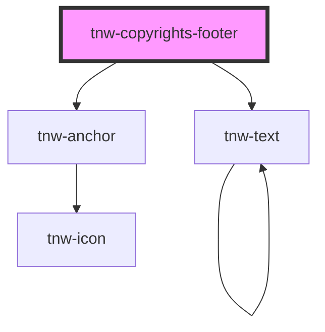

# tnw-copyrights-footer

<!-- Auto Generated Below -->

## Overview

The `tnw-footer` component displays footer information such as the organization name, copyright years, 
and additional text. The component provides flexible options for colors, text layout, and custom slot content.
It can be customized to display dynamic or static years, as well as pre-defined text before and after the organization name.

## Usage

### Tnw-copyrights-footer-usage

### When to use:

- **Displaying Footer Information**: Use `tnw-footer` to display essential information at the bottom of a webpage, such as organization names, copyright details, and important notes.
- **Dynamic or Static Years**: The component is useful for displaying dynamic years (e.g., "2023 - 2024") or static date ranges.
- **Customizable Footer Layout**: When you need a customizable footer that supports text alignment, background colors, and custom content via slots.

### Use Cases:

1. **Standard Footer with Organization Name and Years**:
   Use this when you want to display your organization's name with a start and end year range, along with optional pretext (e.g., "©") and posttext (e.g., "All Rights Reserved").

   @useStory Standard

2. **Footer with Custom Slot Content**:
   Use this case when you need to fully customize the content of the footer, such as including images, links, or any custom HTML content.

   @useStory WithCustomSlot

3. **Footer with Dynamic Years**:
   Automatically display the current year, which is useful for keeping the footer up to date without manual adjustments.

   @useStory DynamicYears

### Additional Considerations:

- **Custom Colors**: You can easily adjust the text color, background color, and top border color of the footer to match your brand’s design.
- **Custom Slot Content**: When using the slot for custom content, make sure the `enableSlot` prop is set to `true` to render your custom HTML or elements in the footer.
- **Text Alignment**: The footer supports centering the content when the `centerContent` prop is enabled, making it adaptable for different layout needs.

## Properties

| Property                    | Attribute                        | Description                                                                                                                                                                                                | Type                                                                                                                                                                                                                     | Default          |
| --------------------------- | -------------------------------- | ---------------------------------------------------------------------------------------------------------------------------------------------------------------------------------------------------------- | ------------------------------------------------------------------------------------------------------------------------------------------------------------------------------------------------------------------------ | ---------------- |
| `backgroundColor`           | `background-color`               | The background color for the footer.                                                                                                                                                                       | `"auto" \| "black" \| "inverse" \| "light" \| "primary" \| "secondary" \| "white"`                                                                                                                                       | `'auto'`         |
| `borderTopColor`            | `border-top-color`               | The color of the top border of the footer.                                                                                                                                                                 | `"auto" \| "black" \| "inverse" \| "light" \| "primary" \| "secondary" \| "white"`                                                                                                                                       | `'auto'`         |
| `centerContent`             | `center-content`                 | Centering text                                                                                                                                                                                             | `boolean`                                                                                                                                                                                                                | `false`          |
| `disableInternalContainer`  | `disable-internal-container`     | If `true`, a container class will be added around the content to align it within the page layout. Default is `false`.                                                                                      | `boolean`                                                                                                                                                                                                                | `false`          |
| `endYear`                   | `end-year`                       | The ending year to display in the footer. If `useCurrentYearAsEndYear` is true, this will default to the current year.                                                                                     | `number`                                                                                                                                                                                                                 | `undefined`      |
| `linksData`                 | `links-data`                     | Array of objects represents links data. Cannot be used when `useCustomLinks` is `true`.                                                                                                                    | `string`                                                                                                                                                                                                                 | `undefined`      |
| `linksLength`               | `links-length`                   | Number of links. Must be provided when `useCustomLinks` is `true`.                                                                                                                                         | `number`                                                                                                                                                                                                                 | `undefined`      |
| `organizationName`          | `organization-name`              | The name of the organization to display in the footer.                                                                                                                                                     | `string`                                                                                                                                                                                                                 | `undefined`      |
| `organizationNameColor`     | `organization-name-color`        | **[DEPRECATED]** since v2.2.0  The color of the organization name. Defaults to the same value as `textColor`.                                                       | `"auto" \| "black" \| "gray100" \| "gray200" \| "gray300" \| "gray400" \| "gray500" \| "gray600" \| "gray700" \| "gray800" \| "gray900" \| "inverse" \| "light" \| "placeholder" \| "primary" \| "secondary" \| "white"` | `this.textColor` |
| `postText`                  | `post-text`                      | Text to display after the organization name.                                                                                                                                                               | `string`                                                                                                                                                                                                                 | `undefined`      |
| `preText`                   | `pre-text`                       | Text to display before the organization name.                                                                                                                                                              | `string`                                                                                                                                                                                                                 | `undefined`      |
| `startYear`                 | `start-year`                     | The starting year to display in the footer. If `useCurrentYearAsStartYear` is true, this will default to the current year.                                                                                 | `number`                                                                                                                                                                                                                 | `undefined`      |
| `textColor`                 | `text-color`                     | The text color for the footer content.                                                                                                                                                                     | `"auto" \| "black" \| "gray100" \| "gray200" \| "gray300" \| "gray400" \| "gray500" \| "gray600" \| "gray700" \| "gray800" \| "gray900" \| "inverse" \| "light" \| "placeholder" \| "primary" \| "secondary" \| "white"` | `'auto'`         |
| `useCurrentYearAsEndYear`   | `use-current-year-as-end-year`   | If true, the ending year will be set to the current year.                                                                                                                                                  | `boolean`                                                                                                                                                                                                                | `false`          |
| `useCurrentYearAsStartYear` | `use-current-year-as-start-year` | If true, the starting year will be set to the current year.                                                                                                                                                | `boolean`                                                                                                                                                                                                                | `false`          |
| `useCustomLinks`            | `use-custom-links`               | If `true`, the footer will render custom links using a slot instead of the `linksData`. Provide accurate `linksLength` when this prop is `true`. When use this prop, the `linksData` prop will be ignored. | `boolean`                                                                                                                                                                                                                | `false`          |
| `useDivAsContainer`         | `use-div-as-container`           | If `true`, the footer will be rendered using a `
` element instead of a `<footer>` element. This is useful when this component is used inside a `<footer>` or inside the component `<tnw-footer>`.     | `boolean`                                                                                                                                                                                                                | `false`          |

## Slots

| Slot           | Description                                                    |
| -------------- | -------------------------------------------------------------- |
| `"copyrights"` | Slot for copyright information.                                |
| `"link-<n>"`   | Slots for custom links (requires `useCustomLinks` to be true). |

## Shadow Parts

| Part           | Description                                                     |
| -------------- | --------------------------------------------------------------- |
| `"container"`  | the `FooterTag` element that contains the footer content.       |
| `"copyrights"` | the `tnw-text` element that displays the copyright information. |

## Dependencies

### Depends on

- [tnw-text](../tnw-text)
- [tnw-anchor](../tnw-anchor)

### Graph

----------------------------------------------

*Built with [StencilJS](https://stenciljs.com/)*
