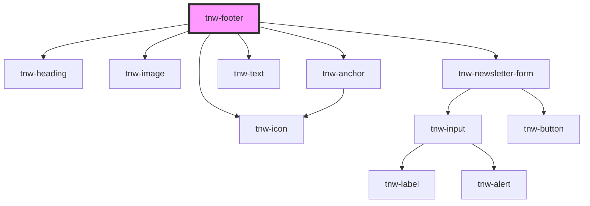

# tnw-lower-footer

<!-- Auto Generated Below -->

## Overview

The `tnw-footer` component displays a structured footer with sections for branding, links, contact information, 
social media, and a newsletter subscription form. It is designed to be highly customizable and accessible.

## Usage

### Tnw-footer-usage

## Properties

| Property                   | Attribute                    | Description                                                                                                                                                                                                                                                                                                                                                                                                                                    | Type                                                                                                                                                                                                                     | Default     |
| -------------------------- | ---------------------------- | ---------------------------------------------------------------------------------------------------------------------------------------------------------------------------------------------------------------------------------------------------------------------------------------------------------------------------------------------------------------------------------------------------------------------------------------------- | ------------------------------------------------------------------------------------------------------------------------------------------------------------------------------------------------------------------------ | ----------- |
| `backgroundColor`          | `background-color`           | The background color for the footer.                                                                                                                                                                                                                                                                                                                                                                                                           | `"auto" \| "black" \| "inverse" \| "light" \| "primary" \| "secondary" \| "white"`                                                                                                                                       | `'auto'`    |
| `borderTopColor`           | `border-top-color`           | The color for the footer border.                                                                                                                                                                                                                                                                                                                                                                                                               | `"auto" \| "black" \| "inverse" \| "light" \| "none" \| "primary" \| "secondary" \| "white"`                                                                                                                             | `'auto'`    |
| `centerContent`            | `center-content`             | Center-align the footer content.                                                                                                                                                                                                                                                                                                                                                                                                               | `boolean`                                                                                                                                                                                                                | `false`     |
| `disableInternalContainer` | `disable-internal-container` | If `true`, a container class will be added around the content to align it within the page layout. Default is `false`.                                                                                                                                                                                                                                                                                                                          | `boolean`                                                                                                                                                                                                                | `false`     |
| `footerData` _(required)_  | `footer-data`                | JSON data for dynamically populating the footer content. Expected structure: {   brand: { logo: string, name: string },   links: { heading: string, items: Array<{ label: string, url: string }> },   contact: { heading: string, email: string, phone: string },   socialmedia: Array<{ iconName: string, url: string }>,   newsletter: {     heading: string,     description: string,     placeholder: string,     buttonText: string   } } | `string`                                                                                                                                                                                                                 | `undefined` |
| `headingColor`             | `heading-color`              | The color for the footer headings.                                                                                                                                                                                                                                                                                                                                                                                                             | `"auto" \| "black" \| "gray100" \| "gray200" \| "gray300" \| "gray400" \| "gray500" \| "gray600" \| "gray700" \| "gray800" \| "gray900" \| "inverse" \| "light" \| "placeholder" \| "primary" \| "secondary" \| "white"` | `'auto'`    |
| `margin`                   | `margin`                     | The margin top size applied to the footer.                                                                                                                                                                                                                                                                                                                                                                                                     | `"2xl" \| "3xl" \| "4xl" \| "lg" \| "md" \| "none" \| "sm" \| "xl" \| "xs"`                                                                                                                                              | `'none'`    |
| `padding`                  | `padding`                    | The padding size applied to the footer.                                                                                                                                                                                                                                                                                                                                                                                                        | `"2xl" \| "3xl" \| "4xl" \| "lg" \| "md" \| "none" \| "sm" \| "xl" \| "xs"`                                                                                                                                              | `'xl'`      |
| `textColor`                | `text-color`                 | The color for the footer content.                                                                                                                                                                                                                                                                                                                                                                                                              | `"auto" \| "black" \| "gray100" \| "gray200" \| "gray300" \| "gray400" \| "gray500" \| "gray600" \| "gray700" \| "gray800" \| "gray900" \| "inverse" \| "light" \| "placeholder" \| "primary" \| "secondary" \| "white"` | `'auto'`    |

## Slots

| Slot            | Description                                                          |
| --------------- | -------------------------------------------------------------------- |
| `"brand"`       | Slot for the brand logo and name.                                    |
| `"contact"`     | Slot for contact information.                                        |
| `"copyrights"`  | Slot for copyright information. Use `tnw-copyrights-footer` instead. |
| `"links"`       | Slot for useful links.                                               |
| `"newsletter"`  | Slot for the newsletter subscription form.                           |
| `"socialmedia"` | Slot for social media icons.                                         |

## Shadow Parts

| Part            | Description                                              |
| --------------- | -------------------------------------------------------- |
| `"brand"`       |                                                          |
| `"contact"`     |                                                          |
| `"container"`   | The container wrapping the footer sections.              |
| `"footer"`      | The main `footer` element wrapping the entire component. |
| `"links"`       |                                                          |
| `"newsletter"`  |                                                          |
| `"socialmedia"` |                                                          |

## Dependencies

### Depends on

- [tnw-heading](../tnw-heading)
- [tnw-image](../tnw-image)
- [tnw-anchor](../tnw-anchor)
- [tnw-text](../tnw-text)
- [tnw-icon](../tnw-icon)
- [tnw-newsletter-form](../tnw-newsletter-form)

### Graph

----------------------------------------------

*Built with [StencilJS](https://stenciljs.com/)*
