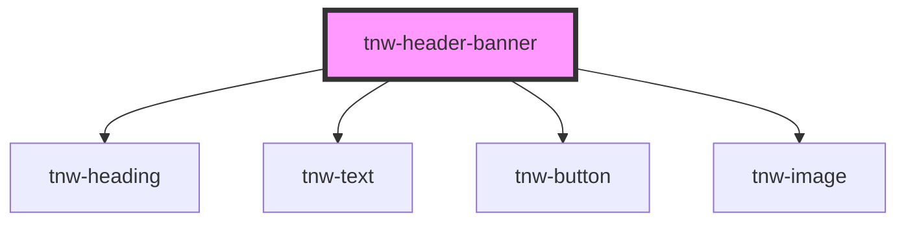

# tnw-header-banner

<!-- Auto Generated Below -->

## Overview

This component is designed to be used inside the `tnw-header`.

The `tnw-header-banner` component creates a customizable banner for headers, featuring headings, subheadings, descriptions, and buttons.
It is designed to align with the theme of the parent header component, making it a cohesive part of the header design.

## Usage

### Tnw-header-banner-usage

### When to use:

- **Header Banners with Call-to-Actions**: Use `tnw-header-banner` to create a visually appealing banner in the header section of your site, featuring a clear call-to-action with a button, heading, and subheading.
- **Promotional or Informational Banners**: Ideal for highlighting promotions, events, or key messages that require attention within a header layout.
- **Customizable Banner Alignment and Layout**: Use this component when you need full control over the alignment, size, and content arrangement in a header banner.

### Use Cases:

1. **Default Header Banner**:
   Use this for a standard banner with a heading, subheading, description, and button in your header section. It's great for drawing attention to important messages or CTAs.

   @useStory Default

2. **Custom Width Banner**:
   When the banner content is smaller and doesn’t need to span the entire width of the screen, this layout allows for a more concise presentation.

   @useStory CustomWidth

3. **Centered Header Banner**:
   For situations where the banner content should be centered both vertically and horizontally, such as for a large hero section or landing page introduction.

   @useStory Centered

### Additional Considerations:

- **Custom Content via Slots**: If you need to insert custom content (e.g., images, videos, or custom HTML), you can use the available slots for heading, subheading, description, and button.
- **Sticky Navigation Compatibility**: The `stickyNavbar` prop ensures that the banner aligns correctly beneath sticky navigation bars, making it perfect for headers with persistent navigation.
- **Theme Matching**: The banner can match the theme of the parent `tnw-header` through its `theme` prop, automatically adjusting text and button colors to fit the overall design.

## Properties

| Property            | Attribute             | Description                                                                                                                                                                             | Type                                                                                                  | Default     |
| ------------------- | --------------------- | --------------------------------------------------------------------------------------------------------------------------------------------------------------------------------------- | ----------------------------------------------------------------------------------------------------- | ----------- |
| `alignment`         | `alignment`           | Controls the alignment of the banner content. Acceptable values are 'start', 'center', or 'end' to align the content horizontally and vertically within the banner. Default is 'start'. | `"center" \| "end" \| "left" \| "right" \| "start"`                                                   | `'start'`   |
| `buttonLabel`       | `button-label`        | The label for the banner's button. If not provided, the button content can be customized via the `button` slot.                                                                         | `string`                                                                                              | `undefined` |
| `description`       | `description`         | The description text of the banner. It offers additional details beneath the heading and subheading, and can be customized via the `description` slot if needed.                        | `string`                                                                                              | `undefined` |
| `enableImageSlot`   | `enable-image-slot`   | Enables the image slot for adding custom images to the banner.                                                                                                                          | `boolean`                                                                                             | `false`     |
| `heading`           | `heading`             | The main heading text of the banner. This can be a simple string or passed through a slot using the `heading` slot.                                                                     | `string`                                                                                              | `undefined` |
| `imageAlt`          | `image-alt`           | Alternative text for the banner image, improving accessibility.                                                                                                                         | `string`                                                                                              | `undefined` |
| `imageBorderRadius` | `image-border-radius` | Controls the border radius of the banner image. It can be set to predefined size types or 'none' for no border.                                                                         | `"2xl" \| "3xl" \| "circle" \| "default" \| "full" \| "lg" \| "md" \| "none" \| "sm" \| "xl" \| "xs"` | `'none'`    |
| `imageSrc`          | `image-src`           | Path to the image file to be displayed in the banner. if provided, the `imageAlt` prop is required.                                                                                     | `string`                                                                                              | `undefined` |
| `stickyNavbar`      | `sticky-navbar`       | When set to `true`, shifts the banner's vertical alignment to account for a sticky header. This ensures that the banner aligns properly beneath the sticky navbar.                      | `boolean`                                                                                             | `false`     |
| `subheading`        | `subheading`          | The subheading text of the banner. It provides secondary information under the main heading and can be customized via the `subheading` slot if needed.                                  | `string`                                                                                              | `undefined` |
| `theme`             | `theme`               | Defines the visual theme of the banner, matching it to the header's theme. Options include 'primary', 'secondary', 'inverse', 'auto', 'white', and 'black'. Default is 'auto'.          | `"auto" \| "black" \| "inverse" \| "primary" \| "secondary" \| "white"`                               | `'auto'`    |
| `width`             | `width`               | Specifies the width of the banner. It can be set to predefined size types or 'full' for full-width coverage.                                                                            | `"full" \| "lg" \| "md" \| "sm" \| "xl"`                                                              | `'full'`    |
| `wrapImage`         | `wrap-image`          | Wraps the image in a container for consistency.                                                                                                                                         | `boolean`                                                                                             | `false`     |

## Slots

| Slot            | Description                                                                |
| --------------- | -------------------------------------------------------------------------- |
| `"button"`      | Slot for custom button content if the `buttonLabel` prop is not used.      |
| `"description"` | Slot for custom description content if the `description` prop is not used. |
| `"heading"`     | Slot for custom heading content if the `heading` prop is not used.         |
| `"subheading"`  | Slot for custom subheading content if the `subheading` prop is not used.   |

## Shadow Parts

| Part                | Description                                                          |
| ------------------- | -------------------------------------------------------------------- |
| `"button"`          | The `tnw-button` element or the container for the button slot.       |
| `"content"`         |                                                                      |
| `"description"`     | The `tnw-text` element displaying the description of the banner.     |
| `"heading"`         | The `tnw-heading` element displaying the main heading of the banner. |
| `"image"`           |                                                                      |
| `"image-container"` |                                                                      |
| `"subheading"`      | The `tnw-heading` element displaying the subheading of the banner.   |

## Dependencies

### Depends on

- [tnw-heading](../tnw-heading)
- [tnw-text](../tnw-text)
- [tnw-button](../tnw-button)
- [tnw-image](../tnw-image)

### Graph

----------------------------------------------

*Built with [StencilJS](https://stenciljs.com/)*
