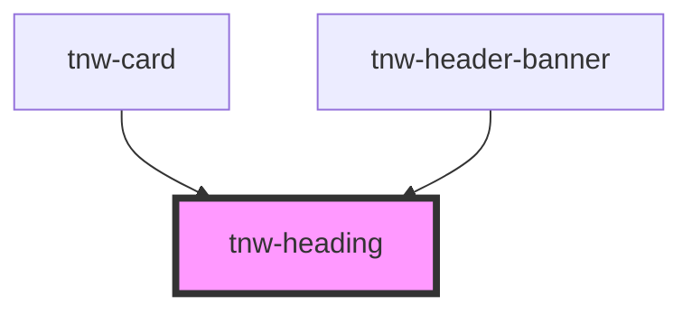

# tnw-heading

<!-- Auto Generated Below -->

## Overview

The `tnw-heading` component is used to render a customizable heading or title with various styling options.
It allows you to control the text alignment, color, size, weight, transformation, and line height, 
along with the ability to use a different HTML tag for the heading element.

## Usage

### Tnw-heading-usage

### When to use:

- **Section Headings**: Use `tnw-heading` to add titles or headings to sections of a page, providing a clear structure for content.
- **Main Page Headings**: Ideal for large headings at the top of pages, such as blog titles, product pages, or landing sections.
- **Custom Heading Styles**: Useful when you need to control the size, font weight, text color, and alignment of your headings for specific design requirements.

### Use Cases:

1. **Standard Heading**:
   Use this for regular section titles, providing a quick overview or introduction to content.

   @useStory Standard

2. **Main Page Heading (H1)**:
   When you need a large, bold heading for the main title of a page, such as a landing or product page.

   @useStory HeadingOne

3. **Primary Color Heading**:
   Use this case when you want to highlight a heading using your theme’s primary color.

   @useStory PrimaryColor

4. **Uppercase Heading**:
   If your design requires the heading to be displayed in uppercase letters, use this case for emphasis or stylistic purposes.

   @useStory Uppercase

5. **Massive Title**:
   For cases where a large, eye-catching title is required, such as for hero sections or feature banners.

   @useStory MassiveTitle

### Additional Considerations:

- **Customizable Text Alignment**: You can adjust the alignment of the heading (left, center, or right) to fit your layout design.
- **Font Weight and Size Control**: With various size and weight options, you can tailor the heading's appearance for both small and large sections, ensuring it blends well with your content structure.
- **Dynamic Heading Tag**: The component supports different HTML heading tags (`h1`, `h2`, `h3`, etc.) or even divs, making it flexible for use in a wide range of contexts.

## Properties

| Property      | Attribute       | Description                                                                            | Type                                                                                                                                                                                                                     | Default     |
| ------------- | --------------- | -------------------------------------------------------------------------------------- | ------------------------------------------------------------------------------------------------------------------------------------------------------------------------------------------------------------------------ | ----------- |
| `alignment`   | `alignment`     | Sets the text alignment within the container.                                          | `"center" \| "end" \| "justify" \| "left" \| "right" \| "start"`                                                                                                                                                         | `undefined` |
| `color`       | `color`         | Sets the color of the text based on the available theme colors.                        | `"auto" \| "black" \| "gray100" \| "gray200" \| "gray300" \| "gray400" \| "gray500" \| "gray600" \| "gray700" \| "gray800" \| "gray900" \| "inverse" \| "light" \| "placeholder" \| "primary" \| "secondary" \| "white"` | `undefined` |
| `headingTag`  | `heading-tag`   | Specifies the HTML tag to be used for the heading.                                     | `"div" \| "h1" \| "h2" \| "h3" \| "h4" \| "h5" \| "h6"`                                                                                                                                                                  | `'h2'`      |
| `lineHeight`  | `line-height`   | Adjusts the line height of the text.                                                   | `"1" \| "1_25" \| "1_5" \| "1_75" \| "2" \| "2_25" \| "2_5"`                                                                                                                                                             | `"1_5"`     |
| `size`        | `size`          | Defines the font size of the text.                                                     | `"2xl" \| "3xl" \| "4xl" \| "5xl" \| "6xl" \| "7xl" \| "8xl" \| "9xl" \| "heading" \| "lg" \| "md" \| "sm" \| "text" \| "xl" \| "xs"`                                                                                    | `undefined` |
| `text`        | `text`          | The content of the heading. If no text is provided, the slot content will be used.     | `string`                                                                                                                                                                                                                 | `undefined` |
| `textCase`    | `text-case`     | Controls the text transformation (e.g., uppercase, lowercase).                         | `"capitalize" \| "lowercase" \| "normal-case" \| "uppercase"`                                                                                                                                                            | `undefined` |
| `useTextFont` | `use-text-font` | If true, applies a text font style to the heading instead of the default heading font. | `boolean`                                                                                                                                                                                                                | `false`     |
| `weight`      | `weight`        | Specifies the font weight of the text.                                                 | `"100" \| "200" \| "300" \| "400" \| "500" \| "600" \| "700" \| "800" \| "900" \| "heading" \| "text"`                                                                                                                   | `undefined` |

## Slots

| Slot | Description                                                        |
| ---- | ------------------------------------------------------------------ |
|      | Use the default slot to add custom content inside the heading tag. |

## Shadow Parts

| Part        | Description                                           |
| ----------- | ----------------------------------------------------- |
| `"heading"` | The root `heading` element rendered by the component. |

## Dependencies

### Used by

 - [tnw-card](../tnw-card)
 - [tnw-header-banner](../tnw-header-banner)

### Graph

----------------------------------------------

*Built with [StencilJS](https://stenciljs.com/)*
