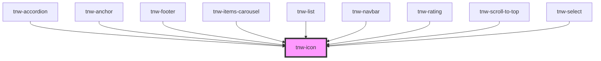

# tnw-icon

<!-- Auto Generated Below -->

## Overview

The `tnw-icon` component is a flexible icon element that supports various styles, sizes, and appearances. 
It can be used as a standalone icon or to display custom SVG icons through the `svg` slot.

## Usage

### Tnw-icon-usage

### When to use:

- **Visual Indicators**: Use `tnw-icon` to display visual indicators such as status icons, action buttons, or brand logos in your UI.
- **Custom SVG Icons**: When you need to insert custom SVG content, this component supports using an SVG slot for more complex or brand-specific icons.
- **Clickable Icons**: For icons that act as buttons, you can use the `isButton` prop to make the icon interactive, such as closing modals or performing actions.

### Use Cases:

1. **Standard Icon**:
   Use this for simple icons where the name defines the icon to be displayed.

   @useStory Standard

2. **Primary Color Icon**:
   Use this case when you want to apply your theme’s primary color to the icon.

   @useStory PrimaryColor

3. **Icon with Different Sizes**:
   When the icon size needs to be adjusted for larger or smaller use cases, such as action buttons or inline icons.

   @useStory IconSizes

4. **Clickable Icon Button**:
   For icons that perform an action (e.g., closing a modal or triggering an event), enable the `isButton` prop to add appropriate ARIA roles and styles.

   @useStory IconButton

### Additional Considerations:

- **Accessibility**: If the icon has a functional role or provides information, ensure it has an appropriate `aria-label` for screen readers. If the icon is decorative or should be hidden from assistive technologies, set `hiddenAria` to `true`.
- **Custom SVG Support**: Use the `enableSvg` prop to display custom SVG icons. This allows you to insert complex vector graphics directly into the component using the slot.
- **Icon Appearances**: Icons support multiple appearances, including solid, outlined, and variations with border radius for more flexible visual customization.

## Properties

| Property          | Attribute          | Description                                                                                                            | Type                                                                                                                                                                                                                     | Default     |
| ----------------- | ------------------ | ---------------------------------------------------------------------------------------------------------------------- | ------------------------------------------------------------------------------------------------------------------------------------------------------------------------------------------------------------------------ | ----------- |
| `appearance`      | `appearance`       | Determines the visual appearance color of the icon (e.g., solid, outlined).                                            | `"mixed" \| "none" \| "outlined" \| "solid" \| "transparent"`                                                                                                                                                            | `'none'`    |
| `appearanceColor` | `appearance-color` | Defines the appearance color of the icon.                                                                              | `"auto" \| "black" \| "danger" \| "info" \| "inverse" \| "light" \| "primary" \| "secondary" \| "success" \| "warning" \| "white"`                                                                                       | `'auto'`    |
| `borderRadius`    | `border-radius`    | Determines the border radius of the icon.                                                                              | `"2xl" \| "3xl" \| "circle" \| "default" \| "full" \| "lg" \| "md" \| "none" \| "sm" \| "xl" \| "xs"`                                                                                                                    | `'default'` |
| `color`           | `color`            | Sets the color of the icon. This will be used to set the color of the icon element. Not supported when svg is enabled. | `"auto" \| "black" \| "gray100" \| "gray200" \| "gray300" \| "gray400" \| "gray500" \| "gray600" \| "gray700" \| "gray800" \| "gray900" \| "inverse" \| "light" \| "placeholder" \| "primary" \| "secondary" \| "white"` | `'auto'`    |
| `enableSvg`       | `enable-svg`       | If `true`, the icon will be rendered as an SVG. The SVG content should be provided via the `svg` slot.                 | `boolean`                                                                                                                                                                                                                | `false`     |
| `hiddenAria`      | `hidden-aria`      | If `true`, the icon will be hidden from screen readers. Defaults to `true`.                                            | `boolean`                                                                                                                                                                                                                | `false`     |
| `isButton`        | `is-button`        | If `true`, the icon will be treated as a button, with appropriate `role` and additional classes.                       | `boolean`                                                                                                                                                                                                                | `false`     |
| `labelAria`       | `label-aria`       | Provides an accessible label for the icon. Defaults to the value of the `name` prop.                                   | `string`                                                                                                                                                                                                                 | `undefined` |
| `name`            | `name`             | The name of the icon to be displayed. This is required when `enableSvg` is not set to `true`.                          | `string`                                                                                                                                                                                                                 | `undefined` |
| `size`            | `size`             | Specifies the size of the icon. The size means that the icon will have the width same as the height.                   | `"2xl" \| "2xs" \| "3xl" \| "3xs" \| "lg" \| "md" \| "sm" \| "xl" \| "xs"`                                                                                                                                               | `'sm'`      |
| `tooltip`         | `tooltip`          | Adds a tooltip to the icon, which will be displayed on hover. This is required when `enableSvg` is not set to `true`.  | `string`                                                                                                                                                                                                                 | `undefined` |

## Slots

| Slot    | Description                                                                                            |
| ------- | ------------------------------------------------------------------------------------------------------ |
| `"svg"` | Use this slot to insert a custom SVG icon. This slot can be used only if `enableSvg` is set to `true`. |

## Shadow Parts

| Part     | Description                                                        |
| -------- | ------------------------------------------------------------------ |
| `"icon"` | The icon element or the container for the custom SVG slot content. |

## Dependencies

### Used by

 - [tnw-accordion](../tnw-accordion)
 - [tnw-anchor](../tnw-anchor)
 - [tnw-footer](../tnw-footer)
 - [tnw-items-carousel](../tnw-items-carousel)
 - [tnw-list](../tnw-list)
 - [tnw-navbar](../tnw-navbar)
 - [tnw-rating](../tnw-rating)
 - [tnw-scroll-to-top](../tnw-scroll-to-top)
 - [tnw-select](../tnw-select)

### Graph

----------------------------------------------

*Built with [StencilJS](https://stenciljs.com/)*
