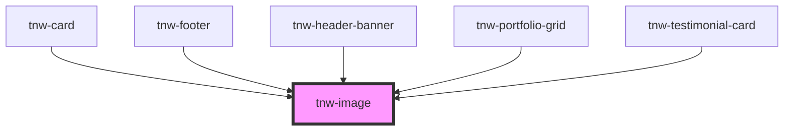

# tnw-image

<!-- Auto Generated Below -->

## Overview

The `tnw-image` component is used to display images with optional captions, lazy loading, and customizable styles. 
It supports various properties to control the image source, dimensions, and appearance.

## Usage

### Tnw-image-usage

### When to use:

- **Displaying Images with Optional Captions**: Use `tnw-image` to display images with optional captions for enhanced context or descriptions.
- **Custom Sizing and Aspect Ratios**: This component is ideal when you need control over the dimensions and aspect ratio of images to fit specific layouts or designs.
- **Optimized Image Loading**: For performance optimization, use the lazy loading feature to load images only when they are about to come into the viewport.

### Use Cases:

1. **Standard Image**:
   Use this case for displaying a basic image, such as a product image or media in a blog post.

   @useStory Standard

2. **Image with Caption**:
   When you need to provide additional context or information below the image, use this option with a caption.

   @useStory ImageWithCaption

3. **Image with Custom Aspect Ratio**:
   For maintaining specific proportions (e.g., 16:9 or 4:3) in your image display, use this case.

   @useStory AspectRatioImage

4. **Image with Object Fit (Cover)**:
   Use this when the image should cover the entire space of its container, such as for full-width hero images or banners.

   @useStory ObjectFitCover

### Additional Considerations:

- **Lazy Loading**: For performance optimization, enable lazy loading so that images load only when they are near the viewport. This is particularly useful for long pages or content-heavy websites.
- **Customizable Sizes and Ratios**: You can easily control the width, height, and aspect ratio to adapt the image to different layouts, ensuring responsive behavior across devices.
- **Object Fit and Position**: The `objectFit` and `objectPosition` properties allow fine control over how the image scales and positions itself within the container, ensuring a precise layout fit.

## Properties

| Property           | Attribute         | Description                                                                                                                                 | Type                                                                                                                                                                                                                                                                    | Default     |
| ------------------ | ----------------- | ------------------------------------------------------------------------------------------------------------------------------------------- | ----------------------------------------------------------------------------------------------------------------------------------------------------------------------------------------------------------------------------------------------------------------------- | ----------- |
| `BorderRadius`     | `border-radius`   | Determines the border radius of the image.                                                                                                  | `"2xl" \| "3xl" \| "circle" \| "default" \| "full" \| "lg" \| "md" \| "none" \| "sm" \| "xl" \| "xs"`                                                                                                                                                                   | `'default'` |
| `alt` _(required)_ | `alt`             | The alternative text for the image, used for accessibility.                                                                                 | `string`                                                                                                                                                                                                                                                                | `undefined` |
| `aspectRatio`      | `aspect-ratio`    | The aspect ratio of the image (width / height). Useful for maintaining image proportions.                                                   | `"16_9" \| "1_1" \| "21_9" \| "3_4" \| "4_3" \| "9_16" \| "9_21" \| "initial"`                                                                                                                                                                                          | `"initial"` |
| `caption`          | `caption`         | An optional caption to be displayed below the image.                                                                                        | `string`                                                                                                                                                                                                                                                                | `''`        |
| `height`           | `height`          | The height of the image. this will be apllied to the `` element. Value should be a valid CSS unit, such as `px`, `em`, or `%`.         | `string`                                                                                                                                                                                                                                                                | `undefined` |
| `heightSize`       | `height-size`     | The height size of the image. This controls the height of the image container. Values are not units, but rather likw `full`, `lg`, `md` ... | `"full" \| "lg" \| "md" \| "sm"`                                                                                                                                                                                                                                        | `undefined` |
| `lazyLoading`      | `lazy-loading`    | If `true`, the image will use lazy loading, loading only when it is about to be visible in the viewport.                                    | `boolean`                                                                                                                                                                                                                                                               | `false`     |
| `objectFit`        | `object-fit`      | Defines how the image should be resized to fit its container. This controls the CSS `object-fit` property.                                  | `"contain" \| "cover" \| "fill" \| "none" \| "scale-down"`                                                                                                                                                                                                              | `undefined` |
| `objectPosition`   | `object-position` | The object position of the image. This defines how the image is positioned within its container.                                            | `"bottom" \| "bottom-left" \| "bottom-right" \| "center" \| "center-bottom" \| "center-left" \| "center-right" \| "center-top" \| "initial" \| "left" \| "left-bottom" \| "left-top" \| "right" \| "right-bottom" \| "right-top" \| "top" \| "top-left" \| "top-right"` | `"initial"` |
| `src` _(required)_ | `src`             | The source URL/Path of the image.                                                                                                           | `string`                                                                                                                                                                                                                                                                | `undefined` |
| `width`            | `width`           | The width of the image. this will be apllied to the `` element. Value should be a valid CSS unit, such as `px`, `em`, or `%`.          | `string`                                                                                                                                                                                                                                                                | `undefined` |
| `widthSize`        | `width-size`      | The width size of the image. This controls the width of the image container. Values are not units, but rather likw `full`, `lg`, `md` ...   | `"full" \| "lg" \| "md" \| "sm"`                                                                                                                                                                                                                                        | `'full'`    |

## Shadow Parts

| Part           | Description                                                          |
| -------------- | -------------------------------------------------------------------- |
| `"figcaption"` | The `<figcaption>` element for the image caption (if provided).      |
| `"figure"`     | The container `<figure>` element for the image and optional caption. |
| `"image"`      | The main `` element rendering the image.                        |

## Dependencies

### Used by

 - [tnw-card](../tnw-card)
 - [tnw-footer](../tnw-footer)
 - [tnw-header-banner](../tnw-header-banner)
 - [tnw-portfolio-grid](../tnw-portfolio-grid)
 - [tnw-testimonial-card](../tnw-testimonial-card)

### Graph

----------------------------------------------

*Built with [StencilJS](https://stenciljs.com/)*
