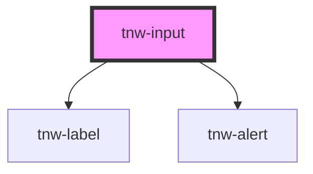

# tnw-input

<!-- Auto Generated Below -->

## Overview

The `tnw-input` component is a customizable input field that supports various input types, validation, and appearance options.
It is designed to be versatile and accessible, allowing for both visual and screen-reader friendly labels, as well as handling error alerts.

## Usage

### Tnw-input-usage

### When to use:

- **Standard Text Input**: Use `tnw-input` for general text input needs such as forms, user profiles, or anywhere basic text input is required.
- **Validation & Alerts**: If your input requires validation (e.g., email validation, error alerts), this component allows for easy integration of alert messages and validation states.
- **Hidden Labels for Accessibility**: When you want to hide the label visually but keep it accessible for screen readers, `tnw-input` allows you to hide labels without sacrificing accessibility.

### Use Cases:

1. **Standard Input Field**:
   Use this for basic text inputs, such as entering a name or other text information.

   @useStory Standard

2. **Input with Help Text**:
   Provide additional context to guide users on how to fill out the input field.

   @useStory InputWithHelpText

3. **Input with Validation Error**:
   Use this when input validation fails, and you need to display an error message to the user.

   @useStory InputWithError

4. **Password Input with Success Alert**:
   Use this to provide feedback on password strength or other success alerts for form fields.

   @useStory PasswordInputWithSuccess

### Additional Considerations:

- **Accessibility**: Ensure that the `alert` and `helpText` attributes are used properly to provide clear instructions and error messages to screen readers.
- **Variants and Custom Styles**: With customizable variants like `underlined` and border radius options, you can adapt the input field to match different UI styles.
- **Label Visibility**: The `isLabelSrOnly` prop allows you to hide labels visually while keeping them accessible to screen readers, ensuring both clean design and accessibility.

## Properties

| Property                   | Attribute          | Description                                                                   | Type                                                                                                  | Default      |
| -------------------------- | ------------------ | ----------------------------------------------------------------------------- | ----------------------------------------------------------------------------------------------------- | ------------ |
| `alert`                    | `alert`            | alert displayed when the input is invalid.                                    | `string`                                                                                              | `''`         |
| `alertType`                | `alert-type`       | Indicates if the input is in an invalid state.                                | `"danger" \| "info" \| "success" \| "warning"`                                                        | `undefined`  |
| `autoComplete`             | `auto-complete`    | The autocomplete setting for the input.                                       | `string`                                                                                              | `'off'`      |
| `borderRadius`             | `border-radius`    | The border radius of the input.                                               | `"2xl" \| "3xl" \| "circle" \| "default" \| "full" \| "lg" \| "md" \| "none" \| "sm" \| "xl" \| "xs"` | `'default'`  |
| `disabled`                 | `disabled`         | Disables the input if set to true.                                            | `boolean`                                                                                             | `false`      |
| `helpText`                 | `help-text`        | The help text providing additional information about the input.               | `string`                                                                                              | `''`         |
| `inputId` _(required)_     | `input-id`         | The unique ID for the input element.                                          | `string`                                                                                              | `undefined`  |
| `isInvalid`                | `is-invalid`       | Indicates if the input has invalid data.                                      | `boolean`                                                                                             | `false`      |
| `isLabelSrOnly`            | `is-label-sr-only` | If true, the label is visually hidden but still accessible to screen readers. | `boolean`                                                                                             | `undefined`  |
| `isRequired`               | `is-required`      | Marks the input as required.                                                  | `boolean`                                                                                             | `false`      |
| `label` _(required)_       | `label`            | The label for the input.                                                      | `string`                                                                                              | `undefined`  |
| `maxlength`                | `maxlength`        | The maximum number of characters allowed in the input.                        | `number`                                                                                              | `undefined`  |
| `minlength`                | `minlength`        | The minimum number of characters required in the input.                       | `number`                                                                                              | `undefined`  |
| `name`                     | `name`             | The name of the input field.                                                  | `string`                                                                                              | `''`         |
| `pattern`                  | `pattern`          | A regex pattern to validate the input.                                        | `string`                                                                                              | `''`         |
| `placeholder` _(required)_ | `placeholder`      | The placeholder text for the input.                                           | `string`                                                                                              | `undefined`  |
| `type` _(required)_        | `type`             | The input type (e.g., text, password).                                        | `string`                                                                                              | `undefined`  |
| `value`                    | `value`            | The initial value of the input.                                               | `string`                                                                                              | `''`         |
| `variant`                  | `variant`          | Defines the color variant of the input.                                       | `"outlined" \| "underlined"`                                                                          | `'outlined'` |

## Shadow Parts

| Part          | Description                                                   |
| ------------- | ------------------------------------------------------------- |
| `"alert"`     | The alert message for validation errors or other information. |
| `"help-text"` | The help text providing additional context for the input.     |
| `"input"`     | The main `<input>` element.                                   |
| `"label"`     | The `<label>` element for the input.                          |

## Dependencies

### Depends on

- [tnw-label](../tnw-label)
- [tnw-alert](../tnw-alert)

### Graph

----------------------------------------------

*Built with [StencilJS](https://stenciljs.com/)*
