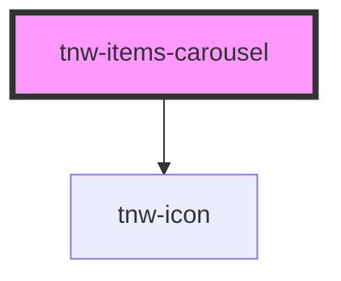

# tnw-items-carousel

<!-- Auto Generated Below -->

## Overview

The `tnw-items-carousel` component provides a flexible and customizable carousel for displaying multiple slides in a row.
The carousel supports custom controls, touch gestures, edge shadows, and can be resized dynamically.

## Usage

### Tnw-items-carousel-usage

### When to use:

- **Image or Content Sliders**: Use `tnw-items-carousel` when you need to showcase multiple items like images, cards, or any other content in a horizontally scrolling format.
- **Custom Control Icons**: If you want to replace the default navigation controls with custom icons, this component supports slots for inserting custom controls.
- **Edge Shadows for Enhanced Visuals**: Enable edge shadows to add a visual cue for scrollable content at the beginning and end of the carousel.
- **Touch Gestures**: Use this carousel for mobile or touch-enabled devices, as it includes built-in support for swipe gestures.

### Use Cases:

1. **Standard Image Carousel**:
   This example demonstrates the use of the carousel to display multiple images.

   @useStory Default

2. **Carousel with Edge Shadows**:
   Edge shadows are used to enhance the carousel's visual style.

   @useStory widthEdgesShadows

### Additional Considerations:

- **Custom Controls**: Use the `enableControlsSlots` property to override the default controls with your custom icons or buttons by providing content in the `control-prev-icon` and `control-next-icon` slots.
- **Accessibility**: Ensure that appropriate labels or ARIA attributes are used for control buttons and carousel items to maintain accessibility.
- **Touch and Gesture Support**: The carousel comes with touch gesture support, allowing users to swipe between slides on touch-enabled devices.
- **Dynamic Content**: Use the slots to customize each slide's content dynamically, such as integrating images, text, or custom elements into each carousel slide.

## Properties

| Property              | Attribute               | Description                                                                     | Type                             | Default |
| --------------------- | ----------------------- | ------------------------------------------------------------------------------- | -------------------------------- | ------- |
| `controlsSize`        | `controls-size`         | Sets the size of the control buttons.                                           | `"lg" \| "md" \| "sm"`           | `'md'`  |
| `enableControlsSlots` | `enable-controls-slots` | If `true`, the `control-prev-icon` and `control-next-icon` slots will be shown. | `boolean`                        | `false` |
| `fitWithContainer`    | `fit-with-container`    | If `true`, the carousel width will be cut to match the container width.         | `boolean`                        | `false` |
| `hideControls`        | `hide-controls`         | Determines whether navigation controls are shown.                               | `boolean`                        | `false` |
| `showEdgesShadows`    | `show-edges-shadows`    | If `true`, shadow effects will be shown on the edges of the carousel.           | `boolean`                        | `false` |
| `slidesCount`         | `slides-count`          | The number of slides in the carousel.                                           | `number`                         | `0`     |
| `slidesSize`          | `slides-size`           | Sets the size of the slides.                                                    | `"lg" \| "md" \| "none" \| "sm"` | `'sm'`  |

## Slots

| Slot                  | Description                                                                                          |
| --------------------- | ---------------------------------------------------------------------------------------------------- |
| `"control-next-icon"` | Custom icon for the next slide control. Can be used when `enableControlsSlots` is set to `true`.     |
| `"control-prev-icon"` | Custom icon for the previous slide control. Can be used when `enableControlsSlots` is set to `true`. |
| `"slide-<n>"`         | Slot for content in the n-th slide.                                                                  |

## Shadow Parts

| Part                   | Description                                                   |
| ---------------------- | ------------------------------------------------------------- |
| `"carousel-slide"`     | The wrapper element for each slide in the carousel.           |
| `"control"`            | The `button` element for the control (next/previous buttons). |
| `"controls-container"` | The container `div` element that wraps the carousel controls. |

## Dependencies

### Depends on

- [tnw-icon](../tnw-icon)

### Graph

----------------------------------------------

*Built with [StencilJS](https://stenciljs.com/)*
