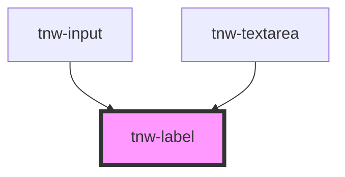

# tnw-label

<!-- Auto Generated Below -->

## Overview

The `tnw-label` component is used to create a text label for a form element like an input or a textarea.
It supports various font sizes, weights, colors, and text transformations. Additionally, it allows the label to be visually hidden while remaining accessible to screen readers.

## Usage

### Tnw-label-usage

### When to use:

- **Form Labels**: Use the `tnw-label` component when you need to label form elements such as inputs, textareas, or checkboxes.
- **Screen Reader-Only Labels**: This component is ideal when you want the label to be accessible to screen readers but hidden visually from users, such as when using icon-based inputs or button controls.
- **Customizable Label Styling**: Use this when you need labels with custom styles such as bold text, uppercase transformation, or specific colors to align with your design system.

### Use Cases:

1. **Standard Form Label**:
   A basic label for form elements such as an input or textarea.

   @useStory Standard

2. **Bold Label**:
   Use this when you need a bolder label to grab more attention.

   @useStory BoldLabel

3. **Uppercase Label**:
   This example transforms the text of the label to uppercase for emphasis.

   @useStory UppercaseLabel

4. **Large Font Label**:
   For forms where labels need to be highly visible, use a larger font size.

   @useStory LargeLabel

5. **Colored Label**:
   When you want to apply specific colors to your labels to indicate importance or for branding.

   @useStory ColoredLabel

### Additional Considerations:

- **Accessibility**: The `htmlFor` attribute is used to associate the label with a specific form element, which is crucial for accessibility.
- **Screen Reader-Only Option**: The `isSrOnly` prop hides the label visually but keeps it accessible to screen readers, which is important for accessibility in minimal UI designs.
- **Custom Styles**: Use the color, size, weight, and text transformation options to easily style the label according to your design system's requirements.

## Properties

| Property               | Attribute    | Description                                                                         | Type                                                                                                                                                                                                                     | Default     |
| ---------------------- | ------------ | ----------------------------------------------------------------------------------- | ------------------------------------------------------------------------------------------------------------------------------------------------------------------------------------------------------------------------ | ----------- |
| `color`                | `color`      | Sets the color of the label based on the available colors.                          | `"auto" \| "black" \| "gray100" \| "gray200" \| "gray300" \| "gray400" \| "gray500" \| "gray600" \| "gray700" \| "gray800" \| "gray900" \| "inverse" \| "light" \| "placeholder" \| "primary" \| "secondary" \| "white"` | `undefined` |
| `htmlFor` _(required)_ | `html-for`   | The `for` attribute, used to associate the label with an input element by ID.       | `string`                                                                                                                                                                                                                 | `undefined` |
| `isSrOnly`             | `is-sr-only` | This prop is used to render the label as a hidden label for accessibility purposes. | `boolean`                                                                                                                                                                                                                | `false`     |
| `size`                 | `size`       | Defines the font size of the label.                                                 | `"lg" \| "md" \| "sm"`                                                                                                                                                                                                   | `"sm"`      |
| `text` _(required)_    | `text`       | The content of the component.                                                       | `number \| string`                                                                                                                                                                                                       | `undefined` |
| `textCase`             | `text-case`  | Controls the text transformation (e.g., uppercase, lowercase).                      | `"capitalize" \| "lowercase" \| "normal-case" \| "uppercase"`                                                                                                                                                            | `undefined` |
| `weight`               | `weight`     | Specifies the font weight of the label.                                             | `"100" \| "200" \| "300" \| "400" \| "500" \| "600" \| "700" \| "800" \| "900" \| "heading" \| "text"`                                                                                                                   | `"500"`     |

## Shadow Parts

| Part      | Description                                                             |
| --------- | ----------------------------------------------------------------------- |
| `"label"` | The `<label>` element itself. This can be targeted for further styling. |

## Dependencies

### Used by

 - [tnw-input](../tnw-input)
 - [tnw-textarea](../tnw-textarea)

### Graph

----------------------------------------------

*Built with [StencilJS](https://stenciljs.com/)*
