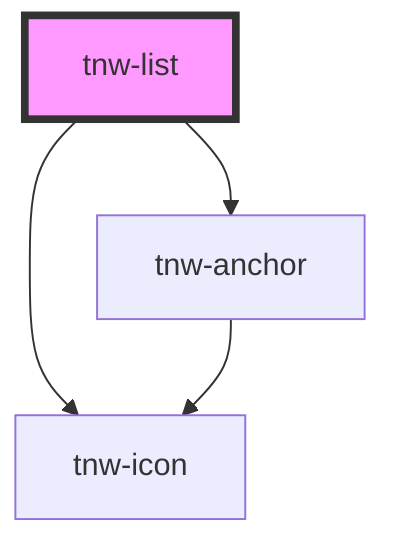

# tnw-list

<!-- Auto Generated Below -->

## Overview

The `tnw-list` component is a customizable list element supporting both ordered and unordered styles.
It allows you to create lists with various marker types, colors, and fonts, and can also include icons within list items.

## Usage

### Tnw-list-usage

### When to use:

- **Standard Lists**: Use the `tnw-list` component when you need to create either ordered or unordered lists with custom markers or icons.
- **Icon-Based Lists**: This component is ideal when you want to add icons next to list items to enhance the visual hierarchy or represent certain statuses.
- **Customizable List Styling**: Use this component to apply custom text styles (color, size, weight, text transformation) to lists for consistent typography in your design system.

### Use Cases:

1. **Standard Unordered List**:
   Use this for simple bullet-point lists, which are commonly used in content formatting.

   @useStory Standard

3. **Colored and Custom Typography List**:
   This case allows you to apply a specific color and typography settings to the list items.

   @useStory CustomColors

### Additional Considerations:

- **Accessibility**: Ensure that lists are semantically structured and avoid using only icons for visual distinctions without proper text or `aria-label` support.
- **Icon Support**: You can add icons to your list items by passing an icon name in the JSON structure. This is useful for checklists or status-based lists.
- **Marker Customization**: You can easily customize the marker types for ordered and unordered lists, offering flexibility in how lists are presented in your UI.

## Properties

| Property         | Attribute         | Description                                                                                    | Type                                                                                                                                                                                                                     | Default     |
| ---------------- | ----------------- | ---------------------------------------------------------------------------------------------- | ------------------------------------------------------------------------------------------------------------------------------------------------------------------------------------------------------------------------ | ----------- |
| `color`          | `color`           | Sets the color of the list items based on the available colors.                                | `"auto" \| "black" \| "gray100" \| "gray200" \| "gray300" \| "gray400" \| "gray500" \| "gray600" \| "gray700" \| "gray800" \| "gray900" \| "inverse" \| "light" \| "placeholder" \| "primary" \| "secondary" \| "white"` | `undefined` |
| `lineHeight`     | `line-height`     | Adjusts the line height of the list items.                                                     | `"1" \| "1_25" \| "1_5" \| "1_75" \| "2" \| "2_25" \| "2_5"`                                                                                                                                                             | `"1_75"`    |
| `listData`       | `list-data`       | A JSON string representing the list data. Each item can contain `text` and an optional `icon`. | `string`                                                                                                                                                                                                                 | `undefined` |
| `markerPosition` | `marker-position` | Specifies the position of the list marker relative to the text.                                | `"inside" \| "outside"`                                                                                                                                                                                                  | `'inside'`  |
| `size`           | `size`            | Defines the font size of the list items.                                                       | `"2xl" \| "3xl" \| "4xl" \| "5xl" \| "6xl" \| "7xl" \| "8xl" \| "9xl" \| "heading" \| "lg" \| "md" \| "sm" \| "text" \| "xl" \| "xs"`                                                                                    | `undefined` |
| `textCase`       | `text-case`       | Controls the list items text transformation (e.g., uppercase, lowercase).                      | `"capitalize" \| "lowercase" \| "normal-case" \| "uppercase"`                                                                                                                                                            | `undefined` |
| `weight`         | `weight`          | Specifies the font weight of the list items.                                                   | `"100" \| "200" \| "300" \| "400" \| "500" \| "600" \| "700" \| "800" \| "900" \| "heading" \| "text"`                                                                                                                   | `undefined` |

## Shadow Parts

| Part     | Description                                                     |
| -------- | --------------------------------------------------------------- |
| `"icon"` | The `tnw-icon` element displayed next to list items (optional). |
| `"item"` | Each `<li>` element representing an individual list item.       |
| `"list"` | The `<ul>` element of the list itself.                          |

## Dependencies

### Depends on

- [tnw-icon](../tnw-icon)
- [tnw-anchor](../tnw-anchor)

### Graph

----------------------------------------------

*Built with [StencilJS](https://stenciljs.com/)*
