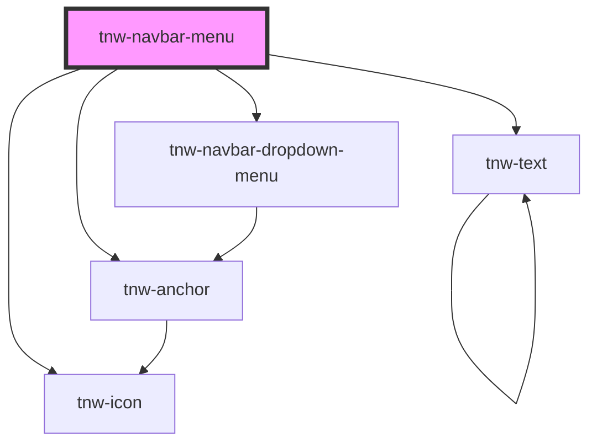

# tnw-navbar-menu

<!-- Auto Generated Below -->

## Overview

The `tnw-navbar-menu` component is designed to be used inside the `tnw-navbar` component. It provides a flexible and responsive navigation menu, which can be configured with various alignment options, hover effects, and styles.
The menu supports nested submenus, text color customization, and adaptive behavior based on breakpoints.

## Usage

### Tnw-navbar-menu-usage

### When to use:

- **Responsive Navigation Menus**: The `tnw-navbar-menu` component is ideal for creating responsive and customizable menus that adapt to different screen sizes.
- **Submenu Support**: Use it when you need a multi-level menu structure, where items can have nested submenus.
- **Customizable Hover Effects**: This component is perfect if you want to apply different hover effects, like color changes, contrast, or opacity adjustments, to menu items.
- **Navigation Menus with Icon Support**: This component is also useful when you need to include icons, like dropdown indicators, alongside menu items.

### Use Cases:

1. **Default Navbar Menu**:
   Use the default configuration for simple navigation menus with clickable items that link to different pages.

   @useStory Default

2. **Navbar Menu with Submenu**:
   This example demonstrates how to use the component when your menu items include submenus, ideal for complex navigation structures.

   @useStory WithSubmenu

3. **Small Menu Items**:
   Use small-sized menu items for compact layouts or minimalist designs.

   @useStory SmallItemsSize

4. **Primary Color with Solid Hover Effect**:
   This example applies a solid hover effect with primary color variants for a more vibrant, interactive experience.

   @useStory PrimaryColorSolidHover

5. **Color Hover with Contrast Effect**:
   Apply a color-based hover effect with contrast changes to highlight menu items as users interact with them.

   @useStory ColorHover

6. **Menu with Large Border Radius**:
   Use this configuration if your design requires menu items with rounded corners for a more modern or soft visual appearance.

   @useStory WithBorderRadius

7. **Hide Navbar Below a Specific Breakpoint**:
   Use this configuration to hide the navbar when the viewport width is below a defined breakpoint, such as 1024px, for mobile responsiveness.

   @useStory HideBelow1024px

### Additional Considerations:

- **Customizable Hover Effects**: You can configure the hover appearance (solid, outlined, color) and apply hover effects (contrast, opacity) for an interactive and visually dynamic menu.
- **Submenu Management**: If your menu requires multiple layers of navigation, the `tnw-navbar-menu` component allows you to define and manage nested submenus.
- **Breakpoint Flexibility**: The component supports hiding the menu below specific breakpoints, ensuring responsiveness on different devices.

## Properties

| Property                 | Attribute                | Description                                                                                                                                                                                                                                                                                                                                                                                                                                                                                                   | Type                                                                                                                                                                                                                     | Default     |
| ------------------------ | ------------------------ | ------------------------------------------------------------------------------------------------------------------------------------------------------------------------------------------------------------------------------------------------------------------------------------------------------------------------------------------------------------------------------------------------------------------------------------------------------------------------------------------------------------- | ------------------------------------------------------------------------------------------------------------------------------------------------------------------------------------------------------------------------ | ----------- |
| `hideBelowBreakpoint`    | `hide-below-breakpoint`  | Hides the menu below a specified breakpoint width (in pixels).                                                                                                                                                                                                                                                                                                                                                                                                                                                | `"1024" \| "767"`                                                                                                                                                                                                        | `"767"`     |
| `itemsBorderRadius`      | `items-border-radius`    | Sets the border-radius of the menu items.                                                                                                                                                                                                                                                                                                                                                                                                                                                                     | `"2xl" \| "3xl" \| "circle" \| "default" \| "full" \| "lg" \| "md" \| "none" \| "sm" \| "xl" \| "xs"`                                                                                                                    | `'default'` |
| `itemsColor`             | `items-color`            | Sets the text color of the menu items.                                                                                                                                                                                                                                                                                                                                                                                                                                                                        | `"auto" \| "black" \| "gray100" \| "gray200" \| "gray300" \| "gray400" \| "gray500" \| "gray600" \| "gray700" \| "gray800" \| "gray900" \| "inverse" \| "light" \| "placeholder" \| "primary" \| "secondary" \| "white"` | `'auto'`    |
| `itemsData` _(required)_ | `items-data`             | The menu data as a JSON string. Each item should include a label, optional link, optional newTab, and optional subMenu. The JSON format should be an array of objects, where each object can include the following properties: - `label`: The text of the menu item. - `link`: (Optional) The URL for the menu item. - `newTab`: (Optional) A boolean indicating whether the link opens in a new tab. - `subMenu`: (Optional) An array of submenu items including item `label`, `link`, and optional newTab.. | `string`                                                                                                                                                                                                                 | `undefined` |
| `itemsHoverAppearance`   | `items-hover-appearance` | Defines the appearance of the hover effect for the menu items (e.g., solid, outlined).                                                                                                                                                                                                                                                                                                                                                                                                                        | `"color" \| "none" \| "outlined" \| "solid"`                                                                                                                                                                             | `'color'`   |
| `itemsHoverEffect`       | `items-hover-effect`     | Sets the hover effect for the menu items.                                                                                                                                                                                                                                                                                                                                                                                                                                                                     | `"contrast" \| "opacity"`                                                                                                                                                                                                | `undefined` |
| `itemsHoverVariant`      | `items-hover-variant`    | Sets the hover variant color for the menu items.                                                                                                                                                                                                                                                                                                                                                                                                                                                              | `"auto" \| "black" \| "inverse" \| "primary" \| "secondary" \| "white"`                                                                                                                                                  | `"primary"` |
| `itemsSize`              | `items-size`             | Sets the font size of the menu items.                                                                                                                                                                                                                                                                                                                                                                                                                                                                         | `"2xl" \| "3xl" \| "4xl" \| "5xl" \| "6xl" \| "7xl" \| "8xl" \| "9xl" \| "heading" \| "lg" \| "md" \| "sm" \| "text" \| "xl" \| "xs"`                                                                                    | `'sm'`      |

## Slots

| Slot | Description                                                                                           |
| ---- | ----------------------------------------------------------------------------------------------------- |
|      | Slot for custom menu content. The menu items will be rendered based on the provided `itemsData` prop. |

## Shadow Parts

| Part        | Description                                                                              |
| ----------- | ---------------------------------------------------------------------------------------- |
| `"item"`    | The `<li>` elements representing individual menu items.                                  |
| `"link"`    | The anchor or span element inside each item, representing the clickable or text content. |
| `"menu"`    | The root `<ul>` element that contains the entire menu.                                   |
| `"submenu"` | The `<tnw-navbar-dropdown-menu>` element for nested submenu items.                       |

## Dependencies

### Depends on

- [tnw-anchor](../tnw-anchor)
- [tnw-icon](../tnw-icon)
- [tnw-text](../tnw-text)
- [tnw-navbar-dropdown-menu](tnw-navbar-dropdown-menu)

### Graph

----------------------------------------------

*Built with [StencilJS](https://stenciljs.com/)*
