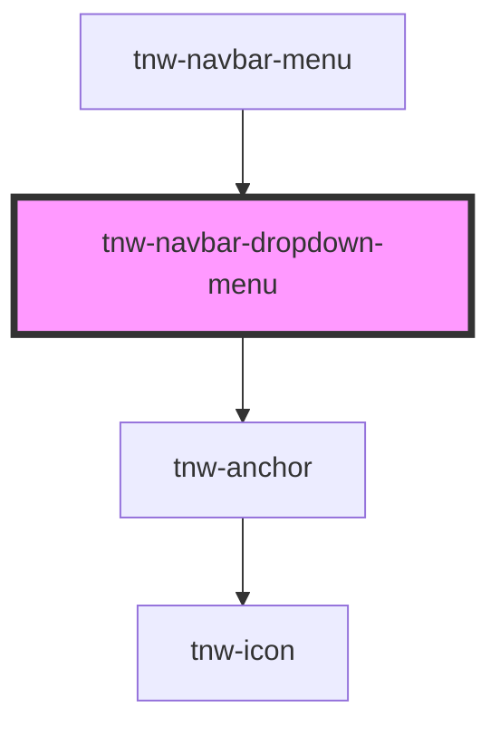

# tnw-navbar-dropdown-menu

<!-- Auto Generated Below -->

## Overview

The `tnw-navbar-dropdown-menu` component is designed to be used within the `tnw-navbar-menu` component to handle dropdown navigation menus.

## Properties

| Property                 | Attribute    | Description                                                                                                            | Type                                                                                                                                  | Default     |
| ------------------------ | ------------ | ---------------------------------------------------------------------------------------------------------------------- | ------------------------------------------------------------------------------------------------------------------------------------- | ----------- |
| `itemsData` _(required)_ | `items-data` | The JSON string representing the dropdown menu items. Each item should include a `label`, `link`, and optional newTab. | `string`                                                                                                                              | `undefined` |
| `itemsSize`              | `items-size` | The size of the items.                                                                                                 | `"2xl" \| "3xl" \| "4xl" \| "5xl" \| "6xl" \| "7xl" \| "8xl" \| "9xl" \| "heading" \| "lg" \| "md" \| "sm" \| "text" \| "xl" \| "xs"` | `'sm'`      |

## Dependencies

### Used by

 - [tnw-navbar-menu](..)

### Depends on

- [tnw-anchor](../../tnw-anchor)

### Graph

----------------------------------------------

*Built with [StencilJS](https://stenciljs.com/)*
