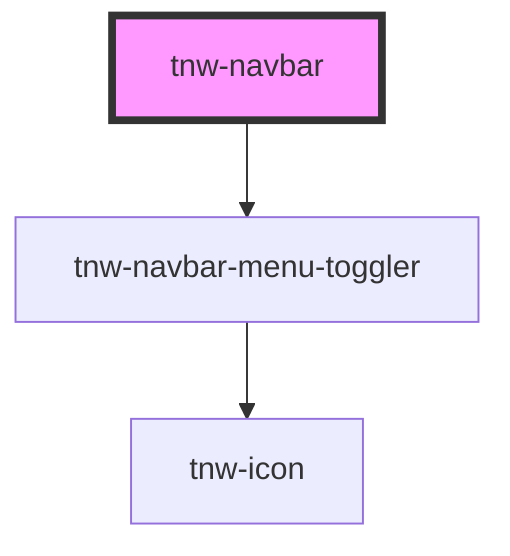

# tnw-navbar

<!-- Auto Generated Below -->

## Overview

The `tnw-navbar` component creates a responsive, customizable navigation bar.
It supports various appearance styles, optional glassmorphism effects, and flexible content slots for building structured navigation systems.

## Usage

### Tnw-navbar-usage

### When to use:

- **Standard Navigation Bars**: Use the `tnw-navbar` component to create a responsive, structured navigation system for your application.
- **Customizable Layout**: Ideal for applications requiring customizable content areas (start, middle, end) with different layouts or slots.
- **Sticky and Fixed Navbar**: When you need a sticky or fixed navigation bar that stays at the top of the viewport during scrolling.
- **Glassmorphism Effect**: To add a frosted glass effect to your navbar for a modern UI design, use the glassmorphism option.

### Use Cases:

1. **Navbar Without Logo**:
   This configuration is useful when you need a simple navigation bar without a logo, but with a structured navigation menu and action button.

   @useStory WithoutLogo

2. **Navbar with Logo and Menu**:
   Perfect for applications that need a logo, navigation menu in the middle, and a button or additional actions at the end.

   @useStory WithLogo

3. **Outlined Navbar**:
   Adds an outline to the navbar for a more distinct separation from the page content. Useful for clear visual hierarchy.

   @useStory Outlined

4. **Underlined Navbar**:
   Creates a navbar with a bottom border. This is ideal for navigation bars where you want a minimalist underline appearance.

   @useStory Underlined

5. **Navbar with Rounded Corners**:
   Provides a rounded corner effect, offering a softer UI design. It can be combined with other appearances for modern design aesthetics.

   @useStory RoundedCorners

6. **Glassmorphism Navbar**:
   For applications that require a more modern design with glassmorphism effects. This is ideal for websites or apps with a futuristic or elegant design approach.

   @useStory GlassmorphismEffect

### Additional Considerations:

- **Responsive Design**: The `tnw-navbar` component is responsive by default, ensuring your navigation works on various screen sizes.
- **Custom Controls**: You can easily customize the menu toggler position (start or end) and use slots for custom icons or actions within the navbar.
- **Glassmorphism and Appearance Styles**: Take advantage of the appearance customization to create transparent, outlined, or solid navigation bars, with additional glassmorphism effects.

## Properties

| Property                   | Attribute                    | Description                                                                                                                            | Type                                                                                                  | Default     |
| -------------------------- | ---------------------------- | -------------------------------------------------------------------------------------------------------------------------------------- | ----------------------------------------------------------------------------------------------------- | ----------- |
| `appearance`               | `appearance`                 | Determines the appearance style of the navigation bar. Supports styles like 'outlined', 'solid', 'transparent', etc.                   | `"mixed" \| "none" \| "outlined" \| "outlined-bottom" \| "solid" \| "transparent"`                    | `'solid'`   |
| `borderRadius`             | `border-radius`              | Sets the border-radius of the navigation bar.                                                                                          | `"2xl" \| "3xl" \| "circle" \| "default" \| "full" \| "lg" \| "md" \| "none" \| "sm" \| "xl" \| "xs"` | `'default'` |
| `burgerMenuPlacement`      | `burger-menu-placement`      | Specifies the placement of the burger menu toggler. Options are 'start' or 'end' of the navbar.                                        | `"end" \| "start"`                                                                                    | `'end'`     |
| `disableInternalContainer` | `disable-internal-container` | If true, the navigation bar content will not be wrapped in a container for centering and padding.                                      | `boolean`                                                                                             | `false`     |
| `exactCenterMiddleSlot`    | `exact-center-middle-slot`   | When true, the middle slot will be centered exactly in the horizontal center of the screen.                                            | `boolean`                                                                                             | `false`     |
| `paddingSize`              | `padding-size`               | Sets the padding size of the navigation bar.                                                                                           | `"lg" \| "md" \| "sm"`                                                                                | `undefined` |
| `sticky`                   | `sticky`                     | Makes the navigation bar sticky at the top of the viewport when set to true.                                                           | `boolean`                                                                                             | `false`     |
| `useEndSlot`               | `use-end-slot`               | Enables the end slot for custom content, like user actions or profile links.                                                           | `boolean`                                                                                             | `false`     |
| `useGlassmorphismEffect`   | `use-glassmorphism-effect`   | Enables a glassmorphism effect for the navigation bar. When true, the navbar will have a frosted glass appearance.                     | `boolean`                                                                                             | `false`     |
| `useMiddleSlot`            | `use-middle-slot`            | Enables the middle slot for custom content, typically used for navigation links.                                                       | `boolean`                                                                                             | `false`     |
| `useStartSlot`             | `use-start-slot`             | Enables the start slot for custom content, such as logos or menus.                                                                     | `boolean`                                                                                             | `false`     |
| `variant`                  | `variant`                    | Specifies the background color variant of the navigation bar. Available options include 'primary', 'secondary', 'black', 'white', etc. | `"auto" \| "black" \| "inverse" \| "light" \| "primary" \| "secondary" \| "white"`                    | `'auto'`    |

## Slots

| Slot       | Description                                                                                                           |
| ---------- | --------------------------------------------------------------------------------------------------------------------- |
| `"end"`    | Slot for the end content (e.g., call-to-action, search, user profile). This slot can be used if `useEndSlot` is true. |
| `"middle"` | Slot for the middle content (e.g., navigation menu). This slot can be used if `useMiddleSlot` is true.                |
| `"start"`  | Slot for the start content (e.g., logo). This slot can be used if `useStartSlot` is true.                             |

## Shadow Parts

| Part                   | Description                                                     |
| ---------------------- | --------------------------------------------------------------- |
| `"controls-container"` | The container for navigation controls like menu togglers.       |
| `"end"`                | The container element for the end content inside the navbar.    |
| `"middle"`             | The container element for the middle content inside the navbar. |
| `"navbar"`             | The root navigation element `<nav>`.                            |
| `"start"`              | The container element for the start content inside the navbar.  |

## Dependencies

### Depends on

- [tnw-navbar-menu-toggler](tnw-navbar-menu-toggler)

### Graph

----------------------------------------------

*Built with [StencilJS](https://stenciljs.com/)*
