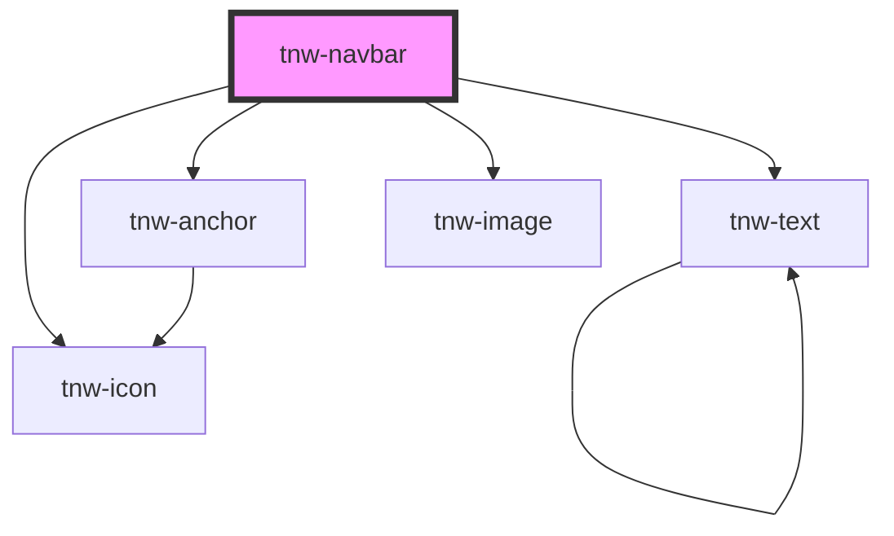

# tnw-navbar

<!-- Auto Generated Below -->

## Overview

The `tnw-navbar` component creates a responsive, customizable navigation bar.
It supports various appearance styles, optional glassmorphism effects, and flexible content slots for building structured navigation systems.

## Usage

### Tnw-navbar-usage

### When to use:

- **Standard Navigation Bars**: Use the `tnw-navbar` component to create a responsive, structured navigation system for your application.
- **Customizable Layout**: Ideal for applications requiring customizable content areas (start, middle, end) with different layouts or slots.
- **Sticky and Fixed Navbar**: When you need a sticky or fixed navigation bar that stays at the top of the viewport during scrolling.
- **Glassmorphism Effect**: To add a frosted glass effect to your navbar for a modern UI design, use the glassmorphism option.

### Use Cases:

1. **Navbar Without Logo**:
   This configuration is useful when you need a simple navigation bar without a logo, but with a structured navigation menu and action button.

   @notuseStory WithoutLogo

### Additional Considerations:

- **Responsive Design**: The `tnw-navbar` component is responsive by default, ensuring your navigation works on various screen sizes.
- **Custom Controls**: You can easily customize the menu toggler position (start or end) and use slots for custom icons or actions within the navbar.
- **Glassmorphism and Appearance Styles**: Take advantage of the appearance customization to create transparent, outlined, or solid navigation bars, with additional glassmorphism effects.

## Properties

| Property                   | Attribute                    | Description                                                                                                                                                                                                                                                                                                                                                                                                                                                                                                   | Type                                                                                                  | Default     |
| -------------------------- | ---------------------------- | ------------------------------------------------------------------------------------------------------------------------------------------------------------------------------------------------------------------------------------------------------------------------------------------------------------------------------------------------------------------------------------------------------------------------------------------------------------------------------------------------------------- | ----------------------------------------------------------------------------------------------------- | ----------- |
| `appearance`               | `appearance`                 | Determines the appearance style of the navigation bar. Supports styles like 'outlined', 'solid', 'transparent', etc.                                                                                                                                                                                                                                                                                                                                                                                          | `"mixed" \| "none" \| "outlined" \| "outlined-bottom" \| "solid" \| "transparent"`                    | `'solid'`   |
| `appearanceStyle`          | `appearance-style`           | Specifies the background color appearance style of the navigation bar. Available options include 'primary', 'secondary', 'black', 'white', etc.                                                                                                                                                                                                                                                                                                                                                               | `"auto" \| "black" \| "inverse" \| "light" \| "primary" \| "secondary" \| "white"`                    | `'auto'`    |
| `borderRadius`             | `border-radius`              | Sets the border-radius of the navigation bar.                                                                                                                                                                                                                                                                                                                                                                                                                                                                 | `"2xl" \| "3xl" \| "circle" \| "default" \| "full" \| "lg" \| "md" \| "none" \| "sm" \| "xl" \| "xs"` | `'default'` |
| `disableInternalContainer` | `disable-internal-container` | If true, the navigation bar content will not be wrapped in a container for centering and padding.                                                                                                                                                                                                                                                                                                                                                                                                             | `boolean`                                                                                             | `false`     |
| `enableCtaSlot`            | `enable-cta-slot`            | If true, the CTA slot is enabled.                                                                                                                                                                                                                                                                                                                                                                                                                                                                             | `boolean`                                                                                             | `false`     |
| `hideMenuBelow`            | `hide-menu-below`            | The breakpoint at which the navbar should be hidden. Set to `false` to always show the navbar.                                                                                                                                                                                                                                                                                                                                                                                                                | `"1024" \| "1439" \| "567" \| "767" \| boolean`                                                       | `false`     |
| `logoData`                 | `logo-data`                  | The logo data as a JSON string. The JSON format should include the following properties: - `src`: The URL of the logo image. - `alt`: The alternative text for the logo image. - `link`: (Optional) The URL for the logo link.                                                                                                                                                                                                                                                                                | `string`                                                                                              | `undefined` |
| `menuData`                 | `menu-data`                  | The menu data as a JSON string. Each item should include a label, optional link, optional newTab, and optional subMenu. The JSON format should be an array of objects, where each object can include the following properties: - `label`: The text of the menu item. - `link`: (Optional) The URL for the menu item. - `newTab`: (Optional) A boolean indicating whether the link opens in a new tab. - `subMenu`: (Optional) An array of submenu items including item `label`, `link`, and optional newTab.. | `string`                                                                                              | `undefined` |
| `menuExactCenter`          | `menu-exact-center`          | When true, the menu will be centered exactly in the horizontal center of the screen. Only if `menuPosition` is set to 'middle'.                                                                                                                                                                                                                                                                                                                                                                               | `boolean`                                                                                             | `false`     |
| `menuPlacement`            | `menu-placement`             | Determines the placement of the menu. Available options are 'start', 'middle', or 'end'.                                                                                                                                                                                                                                                                                                                                                                                                                      | `"end" \| "middle" \| "start"`                                                                        | `'middle'`  |
| `padding`                  | `padding`                    | Sets the padding size of the navigation bar.                                                                                                                                                                                                                                                                                                                                                                                                                                                                  | `"lg" \| "md" \| "none" \| "sm"`                                                                      | `'none'`    |
| `sticky`                   | `sticky`                     | Makes the navigation bar sticky at the top of the viewport when set to true.                                                                                                                                                                                                                                                                                                                                                                                                                                  | `boolean`                                                                                             | `false`     |
| `togglerPlacement`         | `toggler-placement`          | Specifies the placement of the burger menu toggler. Options are 'start' or 'end' of the navbar.                                                                                                                                                                                                                                                                                                                                                                                                               | `"end" \| "start"`                                                                                    | `'end'`     |

## Events

| Event                 | Description                                                                                                          | Type                                                               |
| --------------------- | -------------------------------------------------------------------------------------------------------------------- | ------------------------------------------------------------------ |
| `tnwBreakpointChange` | Emitted when the navbar's responsive breakpoint changes. Event detail contains { breakpoint: string }                | `CustomEvent<{ breakpoint: "1024" \| "767" \| "567" \| "1439"; }>` |
| `tnwMenuToggle`       | Emitted when the menu toggler is clicked. Event detail contains { isOpen: boolean }                                  | `CustomEvent<{ isOpen: boolean; }>`                                |
| `tnwScrollChange`     | Emitted when the navbar's scroll position changes (only when sticky=true). Event detail contains { scrollY: number } | `CustomEvent<{ scrollY: number; }>`                                |

## Slots

| Slot    | Description                                                                                                                                  |
| ------- | -------------------------------------------------------------------------------------------------------------------------------------------- |
| `"cta"` | The slot for custom content to be added to the end side of the navigation bar. To use this slot, set the `enableCtaSlot` property to `true`. |

## Shadow Parts

| Part             | Description                                             |
| ---------------- | ------------------------------------------------------- |
| `"menu"`         | the container for the navigation menu items.            |
| `"menu-item"`    | an individual menu item.                                |
| `"menu-link"`    | a link within a menu item.                              |
| `"navbar"`       | the outermost `nav` element that wraps all the content. |
| `"toggler"`      | the button that toggles the menu visibility.            |
| `"toggler-icon"` | the icon displayed within the toggler button.           |

## Dependencies

### Depends on

- [tnw-icon](../tnw-icon)
- [tnw-anchor](../tnw-anchor)
- [tnw-text](../tnw-text)
- [tnw-image](../tnw-image)

### Graph

----------------------------------------------

*Built with [StencilJS](https://stenciljs.com/)*
