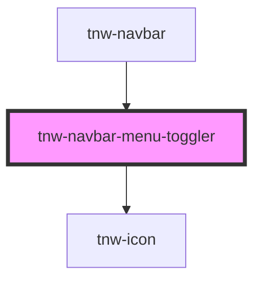

# tnw-navbar-menu-toggler

<!-- Auto Generated Below -->

## Overview

The `tnw-navbar-menu-toggler` component is designed to be used within the `tnw-navbar` component to handle `tnw-navbar-menu` responsive visibility.

## Properties

| Property    | Attribute    | Description                                                                    | Type     | Default                |
| ----------- | ------------ | ------------------------------------------------------------------------------ | -------- | ---------------------- |
| `labelAria` | `label-aria` | Specifies the aria label for the menu toggler icon for accessibility purposes. | `string` | `'Toggle Navbar Menu'` |

## Dependencies

### Used by

 - [tnw-navbar](..)

### Depends on

- [tnw-icon](../../tnw-icon)

### Graph

----------------------------------------------

*Built with [StencilJS](https://stenciljs.com/)*
