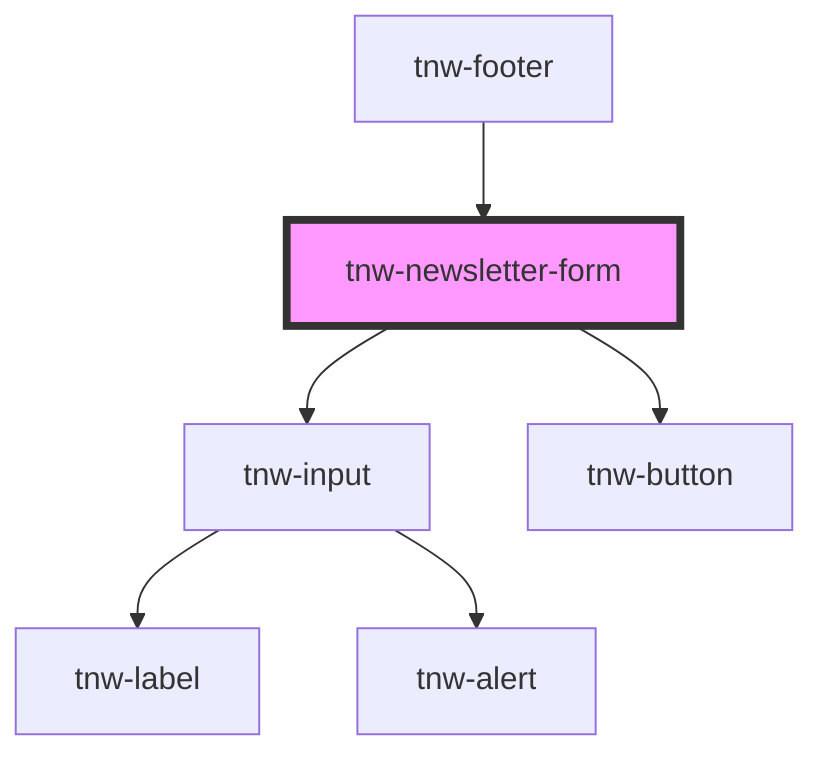

# tnw-newsletter-form

<!-- Auto Generated Below -->

## Usage

### Tnw-newsletter-form-usage

## Properties

| Property           | Attribute            | Description                                                                                                                                        | Type                                                                                                  | Default                     |
| ------------------ | -------------------- | -------------------------------------------------------------------------------------------------------------------------------------------------- | ----------------------------------------------------------------------------------------------------- | --------------------------- |
| `borderRadius`     | `border-radius`      | The border radius for the component. Set for both input and button                                                                                 | `"2xl" \| "3xl" \| "circle" \| "default" \| "full" \| "lg" \| "md" \| "none" \| "sm" \| "xl" \| "xs"` | `'default'`                 |
| `buttonLabel`      | `button-label`       | The label for the subscribe button. If `enableButtonSlot` is true, this prop will be ignored.                                                      | `string`                                                                                              | `'Subscribe'`               |
| `enableButtonSlot` | `enable-button-slot` | Whether to enable the button slot. If true, the buttonLabel prop will be ignored.                                                                  | `boolean`                                                                                             | `false`                     |
| `formAction`       | `form-action`        | The action attribute for the form                                                                                                                  | `string`                                                                                              | `undefined`                 |
| `formAttributes`   | `form-attributes`    | The attributes/data-attribute(s) for the form. The given string is expected to be in the format "key1=value1; key2=value2" or "key1; key2=value2". | `string`                                                                                              | `undefined`                 |
| `formMethod`       | `form-method`        | The method attribute for the form                                                                                                                  | `string`                                                                                              | `undefined`                 |
| `inputId`          | `input-id`           | The id for the email input                                                                                                                         | `string`                                                                                              | `undefined`                 |
| `inputPlaceholder` | `input-placeholder`  | The placeholder for the email input                                                                                                                | `string`                                                                                              | `'Enter your email'`        |
| `successMessage`   | `success-message`    | The message to display after successful subscription                                                                                               | `string`                                                                                              | `'Thanks for subscribing!'` |
| `theme`            | `theme`              | The theme for the component. It controls the color scheme of the component.                                                                        | `"auto" \| "black" \| "inverse" \| "light" \| "primary" \| "secondary" \| "white"`                    | `'primary'`                 |
| `variant`          | `variant`            | The variant for the component                                                                                                                      | `"primary" \| "secondary"`                                                                            | `'primary'`                 |

## Shadow Parts

| Part       | Description |
| ---------- | ----------- |
| `"button"` |             |
| `"input"`  |             |

## Dependencies

### Used by

 - [tnw-footer](../tnw-footer)

### Depends on

- [tnw-input](../tnw-input)
- [tnw-button](../tnw-button)

### Graph

----------------------------------------------

*Built with [StencilJS](https://stenciljs.com/)*
