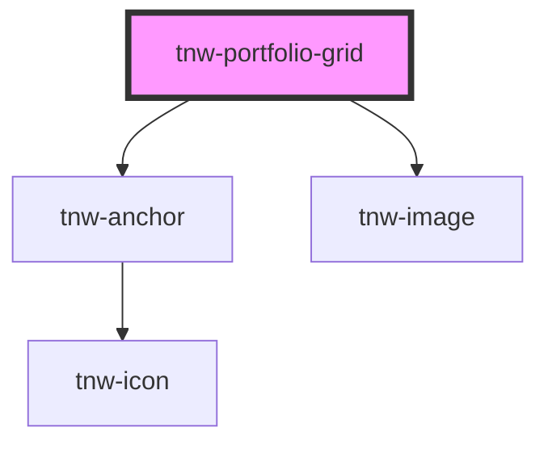

# tnw-portfolio-grid

<!-- Auto Generated Below -->

## Usage

### Tnw-portfolio-grid-usage

## Properties

| Property                 | Attribute    | Description                                                                                                                                                                                                         | Type                                   | Default     |
| ------------------------ | ------------ | ------------------------------------------------------------------------------------------------------------------------------------------------------------------------------------------------------------------- | -------------------------------------- | ----------- |
| `columns`                | `columns`    | Number of columns in the grid layout. Default is 3.                                                                                                                                                                 | `number`                               | `3`         |
| `itemsData` _(required)_ | `items-data` | JSON string containing the grid items data. Each item includes required `src` and `alt` (string), and optional `link` (string), `rowStart` (number), `rowEnd` (number), `colStart` (number), and `colEnd` (number). | `string`                               | `undefined` |
| `spacing`                | `spacing`    | Spacing between grid items (identifies value of CSS gap propery).                                                                                                                                                   | `"lg" \| "md" \| "sm" \| "xl" \| "xs"` | `'sm'`      |

## Dependencies

### Depends on

- [tnw-anchor](../tnw-anchor)
- [tnw-image](../tnw-image)

### Graph

----------------------------------------------

*Built with [StencilJS](https://stenciljs.com/)*
