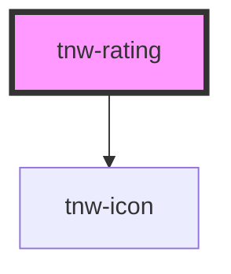

# tnw-rating

<!-- Auto Generated Below -->

## Overview

The `tnw-rating` component is used to display a star-based rating system, allowing users to see a visual representation of a rating out of a total number of stars.

## Usage

### Tnw-rating-usage

### When to use:

- **Displaying Star Ratings**: The `tnw-rating` component is useful when you need to visually represent a rating system, like product reviews, user feedback, or any rating-based content.
- **Customizable Star Ratings**: Use this component when you want control over the number of stars, their size, and their colors, or when you want to display only the filled stars and hide the unfilled ones.

### Use Cases:

1. **Default Rating**:
   Use the default configuration for a basic rating system with a total of 5 stars, where a specific rating value is displayed.

   @useStory Default

2. **Custom Rating with 10 Stars**:
   This example shows how to customize the total number of stars to fit your design requirements, such as using 10 stars instead of 5.

   @useStory IncreaseTotalStars

3. **Custom Star Sizes**:
   When you want the stars to be larger or smaller based on the layout or design needs, use this example to customize the star sizes.

   @useStory LargeRating
   @useStory SmallRating

4. **Hide Empty Stars**:
   If you only want to display the filled stars and hide the unfilled ones, this use case is useful to create a minimalist look.

   @useStory HiddenEmptyStars

### Additional Considerations:

- **Customizable Number of Stars**: You can specify the total number of stars to display, allowing for flexible rating scales beyond the standard 5-star system.
- **Icon Customization**: The component supports custom icons via slots, enabling you to replace the default star icons with custom SVG graphics.
- **Hide Empty Stars**: You can hide the unfilled stars for a cleaner visual, only displaying the filled rating stars.

## Properties

| Property          | Attribute           | Description                                                                    | Type                                                                               | Default                  |
| ----------------- | ------------------- | ------------------------------------------------------------------------------ | ---------------------------------------------------------------------------------- | ------------------------ |
| `emptyStarColor`  | `empty-star-color`  | The color of the empty (unfilled) stars.                                       | `"auto" \| "black" \| "inverse" \| "light" \| "primary" \| "secondary" \| "white"` | `'auto'`                 |
| `filledStarColor` | `filled-star-color` | The color of the filled stars.                                                 | `"auto" \| "black" \| "inverse" \| "light" \| "primary" \| "secondary" \| "white"` | `'primary'`              |
| `hideEmptyStars`  | `hide-empty-stars`  | If true, empty stars (unfilled) will be hidden, showing only the filled stars. | `boolean`                                                                          | `false`                  |
| `rating`          | `rating`            | The current rating value to display as filled stars.                           | `number`                                                                           | `this.totalStars \|\| 0` |
| `starSize`        | `star-size`         | The size of the stars.                                                         | `"lg" \| "md" \| "sm" \| "xl" \| "xs"`                                             | `'sm'`                   |
| `totalStars`      | `total-stars`       | The total number of stars to display in the rating component.                  | `number`                                                                           | `5`                      |

## Slots

| Slot | Description                                                                            |
| ---- | -------------------------------------------------------------------------------------- |
|      | Slot for custom icons. Use the default slot to insert custom content for rating stars. |

## Shadow Parts

| Part             | Description                                                   |
| ---------------- | ------------------------------------------------------------- |
| `"default-icon"` | The `tnw-icon` element used to render the default star icons. |

## Dependencies

### Depends on

- [tnw-icon](../tnw-icon)

### Graph

----------------------------------------------

*Built with [StencilJS](https://stenciljs.com/)*
