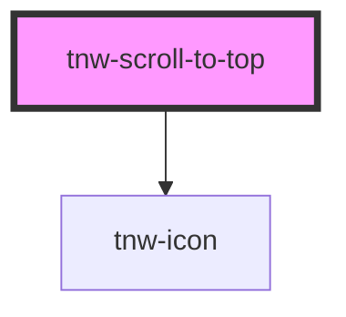

# tnw-scroll-to-top

<!-- Auto Generated Below -->

## Overview

The `tnw-scroll-to-top` component provides a button that allows users to quickly scroll back to the top of the page.
The button becomes visible when the user scrolls down a certain distance.
It supports customization of the icon, size, appearance, and allows for the use of a custom SVG icon.

## Usage

### Tnw-scroll-to-top-usage

### When to use:

- **Scroll Back to Top**: The `tnw-scroll-to-top` component is ideal when you want to provide users with an easy way to return to the top of a page after scrolling a long distance.
- **Customizable Scroll Button**: Use this component when you need flexibility in design, such as customizing the icon, color, size, and appearance of the button to match your brand or application’s theme.

### Use Cases:

1. **Standard Scroll to Top**:
   The default scroll-to-top button, which appears after the user scrolls down a certain distance.

   @useStory Standard

2. **Small Scroll to Top Button**:
   When you need a more subtle or compact scroll-to-top button, this use case allows you to reduce the button size.

   @useStory Small

3. **Large Scroll to Top Button**:
   If you want a more prominent button to encourage users to scroll back up, you can enlarge the button.

   @useStory Large

4. **Secondary Color with Outlined Appearance**:
   Customize the button's color and appearance, making it more aligned with your theme's secondary colors and using an outlined style.

   @useStory SecondaryOutlined

5. **Scroll to Top with Custom Icon**:
   Replace the default icon with a custom one (e.g., a heart icon) to match specific design preferences or branding.

   @useStory CustomIcon

6. **Scroll to Top with Custom SVG Icon**:
   Use this example to insert a custom SVG for the scroll-to-top button, allowing full control over the icon design.

   @useStory CustomSvgIcon

7. **Circular Black Scroll to Top Button**:
   This example shows a fully rounded button with a black background, perfect for minimalistic or dark-themed designs.

   @useStory CircledBlack

### Additional Considerations:

- **Visibility**: The button becomes visible only after the user scrolls past a set threshold, ensuring it's not intrusive when unnecessary.
- **Custom Icons**: You can use either predefined icons or provide your own SVG icon via slots for maximum flexibility.
- **Smooth Scroll**: The button smoothly scrolls the user back to the top, enhancing the user experience.

## Properties

| Property              | Attribute                | Description                                                               | Type                                                                                                  | Default               |
| --------------------- | ------------------------ | ------------------------------------------------------------------------- | ----------------------------------------------------------------------------------------------------- | --------------------- |
| `appearance`          | `appearance`             | Determines the appearance style of the scroll-to-top button.              | `"mixed" \| "outlined" \| "solid" \| "transparent"`                                                   | `'solid'`             |
| `borderRadius`        | `border-radius`          | Determines the border radius.                                             | `"2xl" \| "3xl" \| "circle" \| "default" \| "full" \| "lg" \| "md" \| "none" \| "sm" \| "xl" \| "xs"` | `"default"`           |
| `color`               | `color`                  | Determines the color of the icon.                                         | `"auto" \| "black" \| "inverse" \| "light" \| "primary" \| "secondary" \| "white"`                    | `undefined`           |
| `customIconName`      | `custom-icon-name`       | The name of the custom icon to be used for the scroll-to-top button.      | `string`                                                                                              | `'tnw-arrow-thin-up'` |
| `enableCustomSvgIcon` | `enable-custom-svg-icon` | If true, a custom SVG icon provided via the `icon-svg` slot will be used. | `boolean`                                                                                             | `false`               |
| `size`                | `size`                   | Specifies the size of the scroll-to-top button.                           | `"lg" \| "md" \| "sm" \| "xl" \| "xs"`                                                                | `'md'`                |
| `variant`             | `variant`                | Defines the color variant of the scroll-to-top button.                    | `"auto" \| "black" \| "inverse" \| "light" \| "primary" \| "secondary" \| "white"`                    | `'primary'`           |

## Slots

| Slot         | Description                                                              |
| ------------ | ------------------------------------------------------------------------ |
| `"icon-svg"` | Use this slot to provide a custom SVG icon for the scroll-to-top button. |

## Shadow Parts

| Part     | Description                                            |
| -------- | ------------------------------------------------------ |
| `"icon"` | The icon element used within the scroll-to-top button. |

## Dependencies

### Depends on

- [tnw-icon](../tnw-icon)

### Graph

----------------------------------------------

*Built with [StencilJS](https://stenciljs.com/)*
