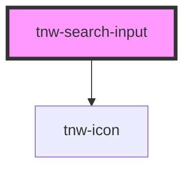

# tnw-search-input

<!-- Auto Generated Below -->

## Overview

The `tnw-search-input` component is a customizable search input field that supports various input types, validation, and appearance options.
It is designed to be versatile and accessible, allowing for both visual and screen-reader friendly labels, as well as handling error alerts.

## Properties

| Property          | Attribute          | Description                                                                          | Type                                                                                                                                                                                                                     | Default                            |
| ----------------- | ------------------ | ------------------------------------------------------------------------------------ | ------------------------------------------------------------------------------------------------------------------------------------------------------------------------------------------------------------------------ | ---------------------------------- |
| `appearance`      | `appearance`       | Defines the appearance of the input.                                                 | `"none" \| "outlined" \| "underlined"`                                                                                                                                                                                   | `'outlined'`                       |
| `appearanceColor` | `appearance-color` | The appearance color of the input, determining the overall color scheme.             | `"auto" \| "black" \| "inverse" \| "light" \| "primary" \| "secondary" \| "white"`                                                                                                                                       | `'auto'`                           |
| `autoComplete`    | `auto-complete`    | The autocomplete setting for the input.                                              | `string`                                                                                                                                                                                                                 | `'on'`                             |
| `borderRadius`    | `border-radius`    | The border radius of the input.                                                      | `"2xl" \| "3xl" \| "circle" \| "default" \| "full" \| "lg" \| "md" \| "none" \| "sm" \| "xl" \| "xs"`                                                                                                                    | `'default'`                        |
| `iconColor`       | `icon-color`       | The color of the search icon.                                                        | `"auto" \| "black" \| "gray100" \| "gray200" \| "gray300" \| "gray400" \| "gray500" \| "gray600" \| "gray700" \| "gray800" \| "gray900" \| "inverse" \| "light" \| "placeholder" \| "primary" \| "secondary" \| "white"` | `undefined`                        |
| `inputId`         | `input-id`         | The unique ID for the input element. If not provided, a random ID will be generated. | `string`                                                                                                                                                                                                                 | `generateRandomId(this.baseClass)` |
| `label`           | `label`            | The label for the input. It will not be displayed (Screen Reader Only).              | `string`                                                                                                                                                                                                                 | `'Search'`                         |
| `name`            | `name`             | The name of the input field.                                                         | `string`                                                                                                                                                                                                                 | `''`                               |
| `placeholder`     | `placeholder`      | The placeholder text for the input.                                                  | `string`                                                                                                                                                                                                                 | `'Search'`                         |
| `type`            | `type`             | The type of the input.                                                               | `"search" \| "text"`                                                                                                                                                                                                     | `'search'`                         |
| `value`           | `value`            | The initial value of the input.                                                      | `string`                                                                                                                                                                                                                 | `''`                               |
| `variant`         | `variant`          | The variant of the search input.                                                     | `"expandable" \| "icon-left" \| "icon-right" \| "no-icon"`                                                                                                                                                               | `'icon-left'`                      |
| `width`           | `width`            | The width of the input. Accepts any valid CSS width value.                           | `string`                                                                                                                                                                                                                 | `'100%'`                           |

## Events

| Event                     | Description                                                                                        | Type                  |
| ------------------------- | -------------------------------------------------------------------------------------------------- | --------------------- |
| `tnwInputBlurred`         | Event emitted when the input loses focus.                                                          | `CustomEvent<void>`   |
| `tnwInputChangedOnChange` | Event emitted when the input value changes. The event's payload contains the new value.            | `CustomEvent<string>` |
| `tnwInputChangedOnType`   | Event emitted when the input value changes. The event's payload contains the new value.            | `CustomEvent<string>` |
| `tnwInputFocused`         | Event emitted when the input receives focus.                                                       | `CustomEvent<void>`   |
| `tnwInputSubmit`          | Event emitted when the Enter key is pressed. The event's payload contains the current input value. | `CustomEvent<string>` |

## Shadow Parts

| Part      | Description                                   |
| --------- | --------------------------------------------- |
| `"icon"`  | The `<tnw-icon>` element for the search icon. |
| `"input"` | The `<input>` element itself.                 |

## Dependencies

### Depends on

- [tnw-icon](../tnw-icon)

### Graph

----------------------------------------------

*Built with [StencilJS](https://stenciljs.com/)*
