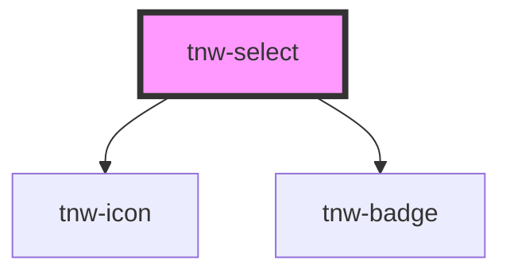

# tnw-select

<!-- Auto Generated Below -->

## Overview

The `tnw-select` component provides a custom dropdown select element with support for dynamic options, selection, and keyboard navigation.

## Usage

### Tnw-select-usage

## Properties

| Property           | Attribute           | Description                                                                                                                                                                                                                                                                                                                                 | Type                                                                                                  | Default              |
| ------------------ | ------------------- | ------------------------------------------------------------------------------------------------------------------------------------------------------------------------------------------------------------------------------------------------------------------------------------------------------------------------------------------- | ----------------------------------------------------------------------------------------------------- | -------------------- |
| `accessibilityId`  | `accessibility-id`  | A custom accessibility ID for the select component. Can be used to provide a specific identifier for screen readers or testing.                                                                                                                                                                                                             | `string`                                                                                              | `undefined`          |
| `borderRadius`     | `border-radius`     | Border radius of the select.                                                                                                                                                                                                                                                                                                                | `"2xl" \| "3xl" \| "circle" \| "default" \| "full" \| "lg" \| "md" \| "none" \| "sm" \| "xl" \| "xs"` | `'default'`          |
| `disabled`         | `disabled`          | If `true`, the select component will be disabled and cannot be interacted with.                                                                                                                                                                                                                                                             | `boolean`                                                                                             | `false`              |
| `fullWidth`        | `full-width`        | If `true`, the select component will expand to fill the full width of its container. Default is `false`, which means the component will size based on its content.                                                                                                                                                                          | `boolean`                                                                                             | `false`              |
| `label`            | `label`             | The label to display when no option is selected.                                                                                                                                                                                                                                                                                            | `string`                                                                                              | `'Select an option'` |
| `optionAppearance` | `option-appearance` | The appearance of the select options. if bordered a border top and bottom will be added to the options.                                                                                                                                                                                                                                     | `"bordered" \| "standard"`                                                                            | `'standard'`         |
| `optionsData`      | `options-data`      | JSON string representing the options available in the select dropdown. Each option can include a label, value, ariaLabel, and disabled state.                                                                                                                                                                                               | `string`                                                                                              | `undefined`          |
| `size`             | `size`              | Controls the size of the select component. Options are 'sm' (small), 'md' (medium), or 'lg' (large). Default is 'md' (medium).                                                                                                                                                                                                              | `"lg" \| "md" \| "sm"`                                                                                | `'md'`               |
| `variant`          | `variant`           | Specifies the variant of the select component.  - `standard`: Default variant without any additional icons or images. - `withIconName`: Variant that includes an icon by name. - `withSvgIcon`: Variant that includes an SVG icon. - `withImage`: Variant that includes an image. - `withStatus`: Variant that includes a status indicator. | `"standard" \| "withIconName" \| "withImage" \| "withStatus" \| "withSvgIcon"`                        | `'standard'`         |

## Events

| Event             | Description                                           | Type                                |
| ----------------- | ----------------------------------------------------- | ----------------------------------- |
| `dropdownToggled` | Emitted when the dropdown is toggled open or closed.  | `CustomEvent<{ isOpen: boolean; }>` |
| `optionSelected`  | Emitted when an option is selected from the dropdown. | `CustomEvent<TnwSelectOption>`      |

## Methods

### `getSelectedOption() => Promise<TnwSelectOption | undefined>`

Retrieves the currently selected option.

#### Returns

Type: `Promise<TnwSelectOption>`

### `resetSelectedOption() => Promise<void>`

Resets the selected option to the default or placeholder label.

#### Returns

Type: `Promise<void>`

### `toggleDropdown() => Promise<void>`

Programmatically toggles the dropdown open or closed.

#### Returns

Type: `Promise<void>`

## Shadow Parts

| Part         | Description                            |
| ------------ | -------------------------------------- |
| `"button"`   | The button that triggers the dropdown. |
| `"dropdown"` | The dropdown container element.        |
| `"option"`   | The individual dropdown option.        |

## Dependencies

### Depends on

- [tnw-icon](../tnw-icon)
- [tnw-badge](../tnw-badge)

### Graph

----------------------------------------------

*Built with [StencilJS](https://stenciljs.com/)*
