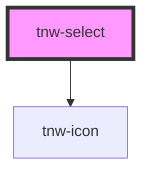

# tnw-select

<!-- Auto Generated Below -->

## Overview

⚠️ COMPONENT IN DEVELOPMENT

The `tnw-select` component provides a custom dropdown select element with support for dynamic options, selection, and keyboard navigation.

## Usage

### Tnw-select-usage

## Properties

| Property                   | Attribute        | Description                                                                                                                                   | Type                                                                                                  | Default              |
| -------------------------- | ---------------- | --------------------------------------------------------------------------------------------------------------------------------------------- | ----------------------------------------------------------------------------------------------------- | -------------------- |
| `borderRadius`             | `border-radius`  | Border radius of the select.                                                                                                                  | `"2xl" \| "3xl" \| "circle" \| "default" \| "full" \| "lg" \| "md" \| "none" \| "sm" \| "xl" \| "xs"` | `'default'`          |
| `defaultOption`            | `default-option` | The default option that should be selected on component load.                                                                                 | `string`                                                                                              | `undefined`          |
| `label`                    | `label`          | The label to display when no option is selected.                                                                                              | `string`                                                                                              | `'Select an option'` |
| `optionsData` _(required)_ | `options-data`   | JSON string representing the options available in the select dropdown. Each option can include a label, value, ariaLabel, and disabled state. | `string`                                                                                              | `undefined`          |

## Events

| Event            | Description                                           | Type                  |
| ---------------- | ----------------------------------------------------- | --------------------- |
| `optionSelected` | Emitted when an option is selected from the dropdown. | `CustomEvent<string>` |

## Shadow Parts

| Part         | Description                            |
| ------------ | -------------------------------------- |
| `"button"`   | The button that triggers the dropdown. |
| `"dropdown"` | The dropdown container element.        |
| `"option"`   | The individual dropdown option.        |

## Dependencies

### Depends on

- [tnw-icon](../tnw-icon)

### Graph

----------------------------------------------

*Built with [StencilJS](https://stenciljs.com/)*
