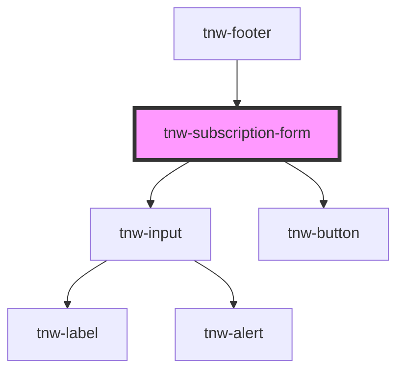

# tnw-subscription-form


<!-- Auto Generated Below -->


## Overview

The `tnw-subscription-form` component provides a customizable subscription form.

## Usage

### Tnw-subscription-form-usage

## Code Examples

### Basic HTML Implementation

```html
<!DOCTYPE html>
<html lang="en">
<head>
    <meta charset="UTF-8">
    <meta name="viewport" content="width=device-width, initial-scale=1.0">
    <title>Newsletter Subscription</title>
    <script type="module" src="/path/to/stencil-library/dist/tnw-subscription-form.js"></script>
</head>
<body>
    <!-- Basic Implementation -->
    <tnw-subscription-form
        buttonLabel="Subscribe Now"
        inputPlaceholder="Your email address"
        successMessage="Welcome to our newsletter!"
        theme="primary"
        borderRadius="rounded"
    ></tnw-subscription-form>

    <!-- Custom Styled Implementation -->
    <tnw-subscription-form
        variant="button-inside"
        theme="secondary"
        borderRadius="pill"
        formAttributes="data-analytics=newsletter-signup"
        style="--tnw-subscription-form-width: 400px;"
    ></tnw-subscription-form>
</body>
</html>
```

### Complete Newsletter Subscription Example

```html
<!DOCTYPE html>
<html lang="en">
<head>
    <meta charset="UTF-8">
    <meta name="viewport" content="width=device-width, initial-scale=1.0">
    <title>Newsletter Subscription</title>
    <script type="module" src="/path/to/stencil-library/dist/tnw-subscription-form.js"></script>
    <style>
        .newsletter-section {
            max-width: 600px;
            margin: 2rem auto;
            padding: 2rem;
            background: #f8f9fa;
            border-radius: 8px;
        }

        tnw-subscription-form {
            --tnw-subscription-form-width: 100%;
            --tnw-subscription-form-gap: 1rem;
        }

        .custom-button {
            display: flex;
            align-items: center;
            gap: 0.5rem;
        }
    </style>
</head>
<body>
    <div class="newsletter-section">
        <h2>Join Our Newsletter</h2>
        <p>Stay updated with our latest news and updates.</p>
        
        <tnw-subscription-form
            id="newsletterForm"
            buttonLabel="Subscribe"
            inputPlaceholder="Enter your email address"
            successMessage="Thank you for subscribing! Please check your email to confirm."
            emailErrorMessage="Please enter a valid email address"
            theme="primary"
            borderRadius="rounded"
            formAttributes="data-source=website; data-campaign=main-newsletter"
        ></tnw-subscription-form>
    </div>

    <script>
        document.addEventListener('DOMContentLoaded', () => {
            const form = document.getElementById('newsletterForm');
            
            // Handle form submission
            form.addEventListener('tnwSubscribe', async (event) => {
                const { email } = event.detail;
                
                try {
                    // Example API call
                    const response = await fetch('https://api.example.com/subscribe', {
                        method: 'POST',
                        headers: {
                            'Content-Type': 'application/json'
                        },
                        body: JSON.stringify({ email })
                    });

                    if (!response.ok) {
                        throw new Error('Subscription failed');
                    }

                    // Success is automatically handled by the component
                } catch (error) {
                    // Dispatch error event to show error message
                    form.dispatchEvent(new CustomEvent('tnwError', {
                        detail: { 
                            message: 'Unable to subscribe at this time. Please try again later.'
                        }
                    }));
                }
            });

            // Track email input changes
            form.addEventListener('tnwEmailChange', (event) => {
                const { email, valid } = event.detail;
                console.log('Email changed:', email, 'Valid:', valid);
            });
        });
    </script>
</body>
</html>
```

### React Implementation Example

```jsx
import React, { useEffect, useRef } from 'react';

const NewsletterSection = () => {
    const formRef = useRef(null);

    useEffect(() => {
        const form = formRef.current;

        const handleSubscribe = async (event) => {
            const { email } = event.detail;
            
            try {
                const response = await fetch('https://api.example.com/subscribe', {
                    method: 'POST',
                    headers: {
                        'Content-Type': 'application/json'
                    },
                    body: JSON.stringify({ email })
                });

                if (!response.ok) {
                    throw new Error('Subscription failed');
                }
            } catch (error) {
                form.dispatchEvent(new CustomEvent('tnwError', {
                    detail: { 
                        message: 'Subscription failed. Please try again.'
                    }
                }));
            }
        };

        form.addEventListener('tnwSubscribe', handleSubscribe);
        
        return () => {
            form.removeEventListener('tnwSubscribe', handleSubscribe);
        };
    }, []);

    return (
        <div className="newsletter-section">
            <h2>Subscribe to Our Newsletter</h2>
            <tnw-subscription-form
                ref={formRef}
                buttonLabel="Join Now"
                inputPlaceholder="Your email address"
                successMessage="Welcome aboard! 🎉"
                theme="primary"
                borderRadius="rounded"
                formAttributes="data-source=react-app"
            ></tnw-subscription-form>
        </div>
    );
};

export default NewsletterSection;


## Properties

| Property           | Attribute            | Description                                                                                                                                                                              | Type                                                                                                  | Default                            |
| ------------------ | -------------------- | ---------------------------------------------------------------------------------------------------------------------------------------------------------------------------------------- | ----------------------------------------------------------------------------------------------------- | ---------------------------------- |
| `borderRadius`     | `border-radius`      | The border radius for the component. Set for both input and button                                                                                                                       | `"2xl" \| "3xl" \| "circle" \| "default" \| "full" \| "lg" \| "md" \| "none" \| "sm" \| "xl" \| "xs"` | `'default'`                        |
| `buttonLabel`      | `button-label`       | The label for the subscribe button. If `enableButtonSlot` is true, this prop will be ignored.                                                                                            | `string`                                                                                              | `'Subscribe'`                      |
| `disabled`         | `disabled`           | Whether to disable the form                                                                                                                                                              | `boolean`                                                                                             | `false`                            |
| `enableButtonSlot` | `enable-button-slot` | Whether to enable the button slot. If true, the buttonLabel prop will be ignored.                                                                                                        | `boolean`                                                                                             | `false`                            |
| `formAction`       | `form-action`        | The action attribute for the form                                                                                                                                                        | `string`                                                                                              | `undefined`                        |
| `formAttributes`   | `form-attributes`    | The attributes/data-attribute(s) for the form. The given string is expected to be in the format "key1=value1; key2=value2" or "key1; key2=value2".                                       | `string`                                                                                              | `undefined`                        |
| `formMethod`       | `form-method`        | The method attribute for the form                                                                                                                                                        | `string`                                                                                              | `undefined`                        |
| `inputId`          | `input-id`           | The id for the email input                                                                                                                                                               | `string`                                                                                              | `generateRandomId(this.baseClass)` |
| `inputPlaceholder` | `input-placeholder`  | The placeholder for the email input                                                                                                                                                      | `string`                                                                                              | `'Enter your email'`               |
| `loading`          | `loading`            | Whether the form is in loading state                                                                                                                                                     | `boolean`                                                                                             | `false`                            |
| `successMessage`   | `success-message`    | The message to display after successful subscription                                                                                                                                     | `string`                                                                                              | `'Thanks for subscribing!'`        |
| `theme`            | `theme`              | The theme for the component. It controls the color scheme of the component.                                                                                                              | `"auto" \| "black" \| "inverse" \| "light" \| "primary" \| "secondary" \| "white"`                    | `'primary'`                        |
| `variant`          | `variant`            | The variant for the component - button-outside: The button is positioned next to the input field (default) - button-inside: The button is positioned inside the input field on the right | `"button-inside" \| "button-outside"`                                                                 | `'button-outside'`                 |


## Events

| Event                | Description                                                                                      | Type                                |
| -------------------- | ------------------------------------------------------------------------------------------------ | ----------------------------------- |
| `tnwBlurred`         | Event emitted when the input loses focus.                                                        | `CustomEvent<void>`                 |
| `tnwChangedOnChange` | Event emitted when the input value changes onChange. The event's payload contains the new value. | `CustomEvent<string>`               |
| `tnwChangedOnInput`  | Event emitted when the input value changes onInput. The event's payload contains the new value.  | `CustomEvent<string>`               |
| `tnwError`           | Event emitted when form submission fails                                                         | `CustomEvent<{ message: string; }>` |
| `tnwFocused`         | Event emitted when the input receives focus.                                                     | `CustomEvent<void>`                 |
| `tnwSubscribe`       | Event emitted when form is submitted with valid email                                            | `CustomEvent<{ email: string; }>`   |


## Shadow Parts

| Part       | Description |
| ---------- | ----------- |
| `"button"` |             |
| `"input"`  |             |


## Dependencies

### Used by

 - [tnw-footer](../tnw-footer)

### Depends on

- [tnw-input](../tnw-input)
- [tnw-button](../tnw-button)

### Graph


----------------------------------------------

*Built with [StencilJS](https://stenciljs.com/)*
