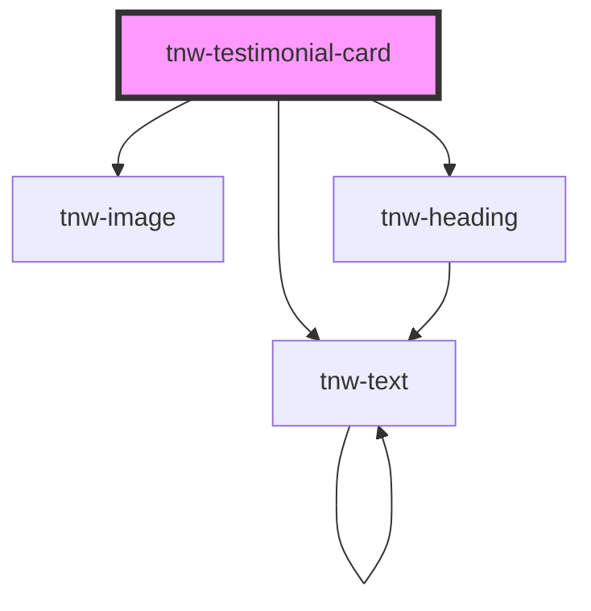

# tnw-testimonial-card

<!-- Auto Generated Below -->

## Overview

The `tnw-testimonial-card` component is a versatile component designed to display testimonials. It includes options for an author's photo, name, role, and a testimonial description, with support for custom styles, spacing, and visual effects.

## Usage

### Tnw-testimonial-card-usage

## Properties

| Property                 | Attribute                  | Description                                                                      | Type                                                                                                  | Default      |
| ------------------------ | -------------------------- | -------------------------------------------------------------------------------- | ----------------------------------------------------------------------------------------------------- | ------------ |
| `appearance`             | `appearance`               | The appearance style of the card.                                                | `"mixed" \| "none" \| "outlined" \| "solid" \| "transparent"`                                         | `'outlined'` |
| `authorName`             | `author-name`              | The name of the author.                                                          | `string`                                                                                              | `undefined`  |
| `authorPhotoAlt`         | `author-photo-alt`         | Alternative text for the author's photo.                                         | `string`                                                                                              | `undefined`  |
| `authorPhotoSrc`         | `author-photo-src`         | The URL of the author's photo.                                                   | `string`                                                                                              | `undefined`  |
| `authorRole`             | `author-role`              | The role or title of the author.                                                 | `string`                                                                                              | `undefined`  |
| `borderRadius`           | `border-radius`            | The border radius applied to the card.                                           | `"2xl" \| "3xl" \| "circle" \| "default" \| "full" \| "lg" \| "md" \| "none" \| "sm" \| "xl" \| "xs"` | `'default'`  |
| `padding`                | `padding`                  | The padding size for the card.                                                   | `"lg" \| "md" \| "none" \| "sm"`                                                                      | `"sm"`       |
| `spacing`                | `spacing`                  | Controls the spacing between description and author details.                     | `"lg" \| "md" \| "sm"`                                                                                | `'sm'`       |
| `text`                   | `text`                     | The text of the testimonial.                                                     | `string`                                                                                              | `undefined`  |
| `useGlassmorphismEffect` | `use-glassmorphism-effect` | If `true`, the card will have a glassmorphism effect applied to its background.  | `boolean`                                                                                             | `false`      |
| `useRandomAvatar`        | `use-random-avatar`        | If `true`, a random gradient avatar will be generated when no photo is provided. | `boolean`                                                                                             | `false`      |
| `variant`                | `variant`                  | The color variant of the card, determining the overall color scheme.             | `"auto" \| "black" \| "inverse" \| "light" \| "primary" \| "secondary" \| "white"`                    | `'auto'`     |

## Shadow Parts

| Part               | Description                                                                  |
| ------------------ | ---------------------------------------------------------------------------- |
| `"author-details"` | The container `div` element for the author's details (name and role).        |
| `"author-name"`    | The `tnw-heading` element displaying the author's name.                      |
| `"author-photo"`   | The `tnw-image` element for the author's photo.                              |
| `"author-role"`    | The `tnw-text` element displaying the author's role.                         |
| `"avatar"`         | The container for the author's avatar or randomly generated gradient avatar. |
| `"description"`    | The `tnw-text` element displaying the testimonial description.               |

## Dependencies

### Depends on

- [tnw-image](../tnw-image)
- [tnw-heading](../tnw-heading)
- [tnw-text](../tnw-text)

### Graph

----------------------------------------------

*Built with [StencilJS](https://stenciljs.com/)*
