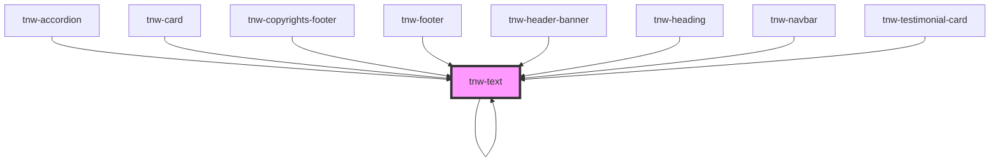

# tnw-text

<!-- Auto Generated Below -->

## Overview

The `tnw-text` component is used to display descriptive text with customizable styling options. 
It supports various typography-related properties, color, and alignment.

## Usage

### Tnw-text-usage

### When to use:

- **Text Display**: Use `tnw-text` to present simple descriptive content, such as paragraphs or small pieces of text, with customizable typography.
- **Headlines & Descriptions**: It is ideal for text components where precise control over color, font size, line height, alignment, and font weight is required.
- **Inline or Block Elements**: You can switch between `p` (block) and `span` (inline) elements based on layout needs.

### Use Cases:

1. **Standard Text**:
   This case demonstrates basic text usage with the default styling options, perfect for paragraphs or body text in various sections.

   @useStory Standard

2. **Gray Color**:
   This use case applies a specific color to the text, showcasing how color customization can be used to tone down or emphasize certain sections.

   @useStory GrayColor

3. **Medium Font Size**:
   Here, the font size is adjusted to medium, ideal for subheadings or smaller content pieces within a larger section.

   @useStory mediumSize

4. **Small Line Height**:
   This example modifies the line height, making the text more compact, useful when dealing with dense content in a small space.

   @useStory SmallLineHeight

5. **Bold Text**:
   Bold text is great for headings or emphasis within a body of text. This example demonstrates how to increase font weight for a stronger visual impact.

   @useStory Bold

### Additional Considerations:

- **Slot Flexibility**: The default slot can be used to insert custom HTML or other components, giving the `tnw-text` component flexibility to adapt to different content types.
- **Customizable Alignment**: The `alignment` prop allows you to fine-tune the placement of the text within its container, offering support for left, right, or centered text.
- **Typography Control**: With control over text transformation, font size, weight, and line height, the `tnw-text` component is a versatile choice for various UI scenarios.

## Properties

| Property          | Attribute          | Description                                                                                                                       | Type                                                                                                                                                                                                                     | Default     |
| ----------------- | ------------------ | --------------------------------------------------------------------------------------------------------------------------------- | ------------------------------------------------------------------------------------------------------------------------------------------------------------------------------------------------------------------------ | ----------- |
| `alignment`       | `alignment`        | Specifies the text alignment.                                                                                                     | `"center" \| "end" \| "justify" \| "left" \| "right" \| "start"`                                                                                                                                                         | `undefined` |
| `color`           | `color`            | Sets the color of the text based on the available colors.                                                                         | `"auto" \| "black" \| "gray100" \| "gray200" \| "gray300" \| "gray400" \| "gray500" \| "gray600" \| "gray700" \| "gray800" \| "gray900" \| "inverse" \| "light" \| "placeholder" \| "primary" \| "secondary" \| "white"` | `undefined` |
| `displayMode`     | `display-mode`     | Defines the display mode of the component. It's not recommended to use the `"inline"` display mode, use `"inline-block"` instead. | `"block" \| "inline" \| "inline-block"`                                                                                                                                                                                  | `"block"`   |
| `highlight`       | `highlight`        | Specifies which piece of text in the `text` prop should be bolded.                                                                | `number \| string`                                                                                                                                                                                                       | `undefined` |
| `highlightColor`  | `highlight-color`  | Specifies the color of the highlighted text.                                                                                      | `"auto" \| "black" \| "gray100" \| "gray200" \| "gray300" \| "gray400" \| "gray500" \| "gray600" \| "gray700" \| "gray800" \| "gray900" \| "inverse" \| "light" \| "placeholder" \| "primary" \| "secondary" \| "white"` | `undefined` |
| `highlightTag`    | `highlight-tag`    | Specifies the HTML tag to be used for the highlighted text. Useful for SEO purposes.                                              | `"em" \| "mark" \| "span" \| "strong"`                                                                                                                                                                                   | `"span"`    |
| `highlightWeight` | `highlight-weight` | Specifies the font weight of the highlighted text.                                                                                | `"100" \| "200" \| "300" \| "400" \| "500" \| "600" \| "700" \| "800" \| "900" \| "heading" \| "text"`                                                                                                                   | `"600"`     |
| `lineHeight`      | `line-height`      | Adjusts the line height of the text.                                                                                              | `"1" \| "1_25" \| "1_5" \| "1_75" \| "2" \| "2_25" \| "2_5"`                                                                                                                                                             | `"1_75"`    |
| `size`            | `size`             | Defines the font size of the text.                                                                                                | `"2xl" \| "3xl" \| "4xl" \| "5xl" \| "6xl" \| "7xl" \| "8xl" \| "9xl" \| "heading" \| "lg" \| "md" \| "sm" \| "text" \| "xl" \| "xs"`                                                                                    | `undefined` |
| `text`            | `text`             | The content of the component.                                                                                                     | `number \| string`                                                                                                                                                                                                       | `undefined` |
| `textCase`        | `text-case`        | Controls the text transformation (e.g., uppercase, lowercase).                                                                    | `"capitalize" \| "lowercase" \| "normal-case" \| "uppercase"`                                                                                                                                                            | `undefined` |
| `textTag`         | `text-tag`         | Defines the HTML tag of the component.                                                                                            | `"em" \| "mark" \| "p" \| "span" \| "strong"`                                                                                                                                                                            | `"p"`       |
| `weight`          | `weight`           | Specifies the font weight of the text.                                                                                            | `"100" \| "200" \| "300" \| "400" \| "500" \| "600" \| "700" \| "800" \| "900" \| "heading" \| "text"`                                                                                                                   | `undefined` |
| `widthSize`       | `width-size`       | The width size of the text. Use unset to avoid setting width.                                                                     | `"full" \| "lg" \| "md" \| "sm" \| "unset" \| "xl"`                                                                                                                                                                      | `'full'`    |

## Slots

| Slot | Description                                                     |
| ---- | --------------------------------------------------------------- |
|      | Use the default slot to add custom content inside the text tag. |

## Shadow Parts

| Part                 | Description                           |
| -------------------- | ------------------------------------- |
| `"highlighted-text"` | The highlighted text content element. |
| `"text"`             | The main text content element.        |

## Dependencies

### Used by

 - [tnw-accordion](../tnw-accordion)
 - [tnw-card](../tnw-card)
 - [tnw-copyrights-footer](../tnw-copyrights-footer)
 - [tnw-footer](../tnw-footer)
 - [tnw-header-banner](../tnw-header-banner)
 - [tnw-heading](../tnw-heading)
 - [tnw-navbar](../tnw-navbar)
 - [tnw-testimonial-card](../tnw-testimonial-card)
 - [tnw-text](.)

### Depends on

- [tnw-text](.)

### Graph

----------------------------------------------

*Built with [StencilJS](https://stenciljs.com/)*
