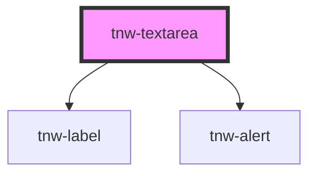

# tnw-textarea

<!-- Auto Generated Below -->

## Overview

The `tnw-textarea` component is a customizable textarea field that supports various appearance options, validation, and accessibility features.

## Usage

### Tnw-textarea-usage

### When to use:

- **User Input**: Use the `tnw-textarea` component when you need users to provide longer text inputs, such as comments, descriptions, or feedback.
- **Forms**: Perfect for form sections where users need to enter multi-line responses.
- **Customizable**: This component provides flexibility for resizing, label visibility, and error handling, making it a great fit for adaptable forms.

### Use Cases:

1. **Standard Textarea**:
   This basic example shows a standard textarea with a label and placeholder, useful for typical text input.

   @useStory Standard

2. **Textarea with Border Radius**:
   This example showcases a textarea with rounded corners, which can make the input field look softer and more appealing.

   @useStory WithBorderRadius

3. **Disabled Textarea**:
   Use this when you need to display a textarea that users can't interact with, perhaps in read-only forms or locked sections.

   @useStory Disabled

4. **Textarea with Error Alert**:
   Shows how to indicate an invalid input with an alert message, ensuring the user is aware of any issues.

   @useStory WithErrorAlert

5. **Textarea with Help Text**:
   This example demonstrates a textarea with helper text, guiding the user on what type of content is expected.

   @useStory WithHelpText

6. **Textarea with Maxlength**:
   Useful for scenarios where you want to limit the number of characters a user can input, such as when there's a strict word or character count requirement.

   @useStory WithMaxlength

7. **Textarea with Vertical Resize**:
   Shows how the textarea can be set to resize vertically, ideal for situations where space is limited horizontally but input may grow vertically.

   @useStory VerticalResize

8. **Textarea with Hidden Label (Screen Reader Only)**:
   This example demonstrates how to visually hide the label while keeping it accessible for screen readers, making it great for accessibility improvements.

   @useStory HiddenLabel

### Additional Considerations:

- **Alert Handling**: Customize alert messages for invalid or incorrect inputs.
- **Resize Control**: Use the `resize` prop to control how users can resize the textarea, or disable resizing altogether.
- **Responsive Design**: The component supports flexible layouts, with options to disable or enable resizing based on screen size or user needs.

## Properties

| Property                   | Attribute           | Description                                                                                                                                                                                                                                                                       | Type                                                                                                  | Default      |
| -------------------------- | ------------------- | --------------------------------------------------------------------------------------------------------------------------------------------------------------------------------------------------------------------------------------------------------------------------------- | ----------------------------------------------------------------------------------------------------- | ------------ |
| `appearance`               | `appearance`        | Defines the appearance of the textarea.                                                                                                                                                                                                                                           | `"outlined" \| "underlined"`                                                                          | `'outlined'` |
| `autoComplete`             | `auto-complete`     | The autocomplete setting for the textarea.                                                                                                                                                                                                                                        | `string`                                                                                              | `''`         |
| `borderRadius`             | `border-radius`     | The border radius of the textarea.                                                                                                                                                                                                                                                | `"2xl" \| "3xl" \| "circle" \| "default" \| "full" \| "lg" \| "md" \| "none" \| "sm" \| "xl" \| "xs"` | `'default'`  |
| `cols`                     | `cols`              | The visible width of the textarea.                                                                                                                                                                                                                                                | `number`                                                                                              | `undefined`  |
| `disabled`                 | `disabled`          | Disables the textarea if set to true.                                                                                                                                                                                                                                             | `boolean`                                                                                             | `false`      |
| `helpText`                 | `help-text`         | The help text providing additional information about the textarea.                                                                                                                                                                                                                | `string`                                                                                              | `''`         |
| `isLabelSrOnly`            | `is-label-sr-only`  | If true, the label is visually hidden but still accessible to screen readers.                                                                                                                                                                                                     | `boolean`                                                                                             | `undefined`  |
| `isRequired`               | `is-required`       | Marks the textarea as required.                                                                                                                                                                                                                                                   | `boolean`                                                                                             | `false`      |
| `label` _(required)_       | `label`             | The label for the textarea.                                                                                                                                                                                                                                                       | `string`                                                                                              | `undefined`  |
| `maxlength`                | `maxlength`         | The maximum number of characters allowed in the textarea.                                                                                                                                                                                                                         | `number`                                                                                              | `undefined`  |
| `minlength`                | `minlength`         | The minimum number of characters required in the textarea.                                                                                                                                                                                                                        | `number`                                                                                              | `undefined`  |
| `name`                     | `name`              | The name of the textarea field.                                                                                                                                                                                                                                                   | `string`                                                                                              | `''`         |
| `placeholder` _(required)_ | `placeholder`       | The placeholder text for the textarea.                                                                                                                                                                                                                                            | `string`                                                                                              | `undefined`  |
| `resize`                   | `resize`            | Controls the resize behavior of the textarea.                                                                                                                                                                                                                                     | `"both" \| "horizontal" \| "none" \| "vertical"`                                                      | `'vertical'` |
| `rows`                     | `rows`              | The number of visible text lines for the textarea.                                                                                                                                                                                                                                | `number`                                                                                              | `3`          |
| `sanitizeTextarea`         | `sanitize-textarea` | Determines whether the textarea value should be sanitized during change events to prevent SQL injection attacks. If set to `true`, the textarea will be sanitized before being validated. If set to `false`, the textarea will still undergo validation but without sanitization. | `boolean`                                                                                             | `false`      |
| `textareaId`               | `textarea-id`       | The unique ID for the textarea element. If not provided, a random ID will be generated.                                                                                                                                                                                           | `string`                                                                                              | `undefined`  |
| `value`                    | `value`             | The initial value of the textarea.                                                                                                                                                                                                                                                | `string`                                                                                              | `''`         |

## Events

| Event              | Description                                                                                                                                                                             | Type                                                  |
| ------------------ | --------------------------------------------------------------------------------------------------------------------------------------------------------------------------------------- | ----------------------------------------------------- |
| `textareaChanged`  | Event emitted when the textarea value changes. The event's payload contains the new value.                                                                                              | `CustomEvent<string>`                                 |
| `validationFailed` | Event emitted when validation fails.  The event payload contains: - `textareaId`: The unique ID of the textarea element. - `error`: A string message explaining the validation failure. | `CustomEvent<{ textareaId: string; error: string; }>` |

## Shadow Parts

| Part          | Description                                                       |
| ------------- | ----------------------------------------------------------------- |
| `"alert"`     | The element that displays the alert when the textarea is invalid. |
| `"help-text"` | The element that displays help text below the textarea.           |
| `"label"`     | The label element associated with the textarea.                   |
| `"textarea"`  | The textarea element itself.                                      |

## Dependencies

### Depends on

- [tnw-label](../tnw-label)
- [tnw-alert](../tnw-alert)

### Graph

----------------------------------------------

*Built with [StencilJS](https://stenciljs.com/)*
